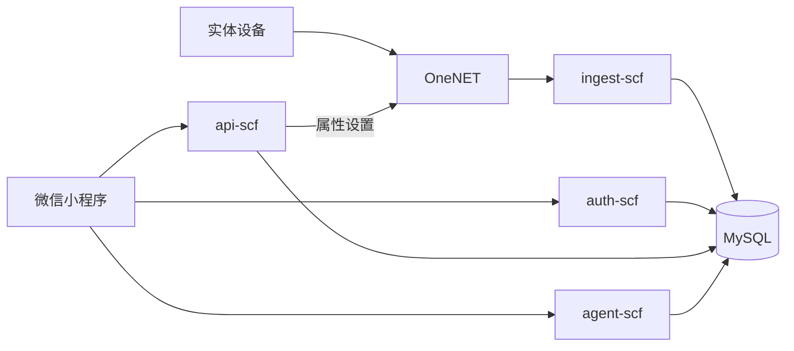

> 历史快照，归档于 2026-09-08。保留当时描述和失败记录，不作为当前事实。当前入口见[先看这里](../../先看这里.md)，技术事实见[当前架构](../../current-architecture.md)。

# TRT Nova 当前系统现状与改进路线

> 2026-09-07 阅读入口已收窄：[先看这里](../.././先看这里.md)。本文保留阶段追踪底稿；下方 9 月 3 日统计是历史批次，不代表最新复跑。M7 本地收尾与 M8 云端/真机分开验收。

> 文档定位：当前实现基线、问题清单与阶段改进计划  
> 基线目录：`TRT_Nova_MVP_miniprogram_LastScf`  
> 基线日期：2026-07-18  
> 最近审阅：2026-09-07（上下文记忆替换；最新结果见《先看这里》）
> 上位文档：[植宠软件系统架构蓝图](../.././plant-pet-software-system-blueprint.md)

> 2026-09-03 本地阶段补充：`feat/wechat-prd-v0.1` 已完成 M1–M6 本地闭环；M7 Phase 0–5 的代码、Schema、API、页面和统一 A/B/C 自动关闭门均已形成证据。Run16 为 403/403 单元、5/5 产品合同、42/42 legacy 基线、148/148 本地 MySQL/API/已配置 Provider、88/88 DevTools、31 张截图、0 页面运行时异常，总退出码 0；当前状态是“本地自动验收候选通过，等待项目负责人终局人工签字”。生产源码使用标准 Node 20 可运行、PI 语义兼容的最小内部 Runtime，不是官方 `pi-agent-core`。Shadow 与受控灰度在仓库样例/云候选中仍默认关闭；当前被 Git 忽略的本机验收配置显式开启 rollout=true/sample=1，Run16 隔离进程也强制相同值，但都不代表体验版、正式版或真实用户切流。尚未部署到目标云环境，也没有实体手机/真实用户灰度结论。下文涉及 PlantPet、todo、journal、media、knowledge、weather、AI 和自动化测试的旧缺口，以本次补充后的表格与数据模型描述为准。

---

## 0. 本文与架构蓝图的分工

《植宠软件系统架构蓝图》回答“长期应建设成什么样”，原则上保持稳定。

本文回答：

1. 当前代码和已验证链路实际做到什么程度；
2. 当前实现与目标架构之间有哪些差距；
3. 哪些问题正在影响安全、可靠性和产品闭环；
4. 下一阶段具体改什么、怎样验收、完成后更新什么状态。

本文会随代码、部署和测试结果持续更新。不得用本文中的临时技术限制反向缩小长期架构愿景，也不得把架构蓝图中的目标能力写成当前已经实现。

### 0.1 状态口径

| 状态 | 定义 |
|---|---|
| 已验证 | 在目标环境通过可重复验收，并有结果或测试证据 |
| 已实现待验证 | 代码存在，但没有完成目标环境或完整链路验证 |
| 局部实现 | 只覆盖部分场景、快乐路径或界面壳 |
| 未建设 | 当前没有可使用实现 |
| 存在风险 | 功能可运行，但有安全、数据或稳定性问题，不能按正式能力承诺 |

“曾经手工跑通过一次”只能作为联调记录，不自动等于稳定的“已验证”。

---

## 1. 当前版本范围与基线说明

### 1.1 当前工作目录

本文只审视：

`TRT_Nova_MVP_miniprogram_LastScf`

该目录在仓库历史中对应“采用简易 SCF 后端”的版本。仓库另有 `TRT_Nova_MVP_miniprogram` 兄弟目录，包含后续 Redis 改造。两个目录尚未被明确收敛成唯一正式主线，因此不能把兄弟目录的能力算入本基线。

### 1.2 当前主要技术组成

- 微信小程序原生页面：主要用户端；
- Flutter：多页面 UI 原型，目前使用 mock 数据；
- `auth-scf`：微信登录、用户落库、JWT 签发；
- `api-scf`：设备、待办、日记、植物库、用户资料与下行控制；
- `ingest-scf`：OneNET/EMQX 数据接入、归一化和历史写入；
- `agent-scf`：NOVA 会话、事件支持的当前分支投影、PlantPet/业务上下文、发布知识 RAG、已确认长期记忆召回、确认式记忆/任务 proposal、Chat/Vision、无限状态和每日用量观测；模型无正式业务写入或设备控制权限；
- `history-cleanup-scf`：历史数据定期清理实现；
- MySQL：当前业务和设备数据主库；
- OneNET：当前已文档化的正式设备接入和控制平台；
- QWeather：M5 天气事实来源，由后端代理使用专属 API Host 和短期 JWT 访问；
- CloudBase 兼容代码：保留在仓库中，但不再是设备正式主链路。

### 1.3 当前实际主链路

控制和状态回显是两条相连但不同的链路：

- 控制：小程序 → `api-scf /device/cmd` → OneNET → 设备；
- 回显：设备重新上报 → `ingest-scf` → `device_latest` → 小程序。

因此 `/device/cmd` 成功只表示平台接受或发送了命令，不能表示设备已经完成执行。

---

## 2. 当前用户可见效果

### 2.1 微信小程序

当前已有页面：

- 首页（我的花园）：植宠档案、真实今日/逾期任务、可解释养护状态、真实天气和确定性节气提示；
- 助手：NOVA 连续对话、可读知识来源、拍照观察、诊断保存、确认式长期记忆、任务 proposal 预览/编辑/确认、多会话分支/撤回，以及切换 PlantPet/会话时的异步结果隔离；
- 日历：真实养护任务的周/月视图、日轴、完成与延期；
- 植物库：植物浏览、搜索、收藏与养护内容；
- 天气城市：手动城市搜索、主动定位解析和当前城市偏好；
- 我的：用户资料和相关功能入口；
- 设备绑定、设备详情、设备设置；
- 植物日记、花园、资料编辑、关于页面。

当前效果已经超过纯静态原型，部分页面能消费真实 SCF/MySQL 数据。但体验仍存在以下 Demo 特征：

- 本地手机号体验入口无服务端验证，但已默认关闭并由开发配置显式开启；
- 部分配置和字段映射硬编码；
- 网络失败、陈旧数据和空状态尚未完全统一；
- 页面逻辑较重，首页和设备详情承担了较多数据转换与业务判断；
- M1–M6 已有单元、API/数据库验证与微信开发者工具 E2E；M7 Phase 0–5 已由 Run16 完成本地 A/B/C 自动关闭门，仍待项目负责人的主观体验验收与签字。设备、云端部署、体验版、实体手机仍需各自的目标环境验收。

### 2.2 Flutter

当前已有登录、首页、助手、植物库、资料、设备详情、设置和日记等 UI 页面，能够表达未来独立 App 的主要信息架构。

当前仍主要依赖 `mock_data.dart`：

- 没有接入真实微信/账号认证；
- 没有接入当前 SCF API；
- 没有正式 Token 和会话持久化；
- 没有形成与小程序共享的契约测试；
- 尚不能被视为正式第二客户端。

短期应将其定位为体验原型，避免与小程序同时维护两套尚未稳定的业务实现。

### 2.3 植物管家 Agent

当前 `agent-scf` 已具备：

- `/agent/session` 会话、PlantPet、结构化记忆、无限状态和当日用量读取；
- `/agent/chat` 保留当前有效分支的完整原文，不再按20轮/30天删除；40条仅为页面分页大小。Chat、回退、Vision和文档共用近期完整原话、自动前文摘要和已开启的跨会话摘要，同时保留业务事实与已发布知识的受控读取；
- `/vision/analyze` 对 JPEG/PNG/WebP 的真实多模态观察，结构化返回候选、置信度、可见迹象、可能原因、建议和补拍问题；
- 比赛阶段所有账户 Chat/Vision 无限；`ai_usage_daily` 继续按 Asia/Shanghai 自然日记录调用次数和 token 用量但不阻断请求；原始消息保留到用户删除；
- 模型未配置、模型失败、非植物、坏图和超限时的明确手动路径；
- 受控副作用边界：模型不直接控制设备或写 PlantPet、正式任务、日记、诊断；`propose_care_task` 仅生成待确认候选。低风险跨会话摘要在用户一次开启后自动增量整理，与正式任务权限分开；旧 `propose_memory_candidate` 只保留兼容，不再作为正常聊天记忆入口；
- M7 使用标准 Node 20 可运行、PI 语义兼容的最小 `PlantPetRuntime`，不是官方 PI Core。Shadow/受控灰度均默认关闭；开启并稳定抽中后，大多数普通低风险 Query 可交给 LLM，确定性代码只保留鉴权/owner、能力 allowlist、知识发布状态、明确任务与记忆意图、参数/结果/高风险和确认门禁；
- 事件支持的会话投影：`ai_messages` 是可读账本，`ai_conversation_events` 是追加式审计；模型只看到当前有效分支和未撤回完整轮次。重新编辑事务性创建分支，撤回只处理本人当前会话最后一轮；

本地人工验收的运行入口与自动 runner 分离：`npm run acceptance-m7-full` 会清理自己启动的隔离 Node/MySQL，不负责在退出后维持交互环境；项目负责人手工验收前应执行 `npm run manual-acceptance:start`，以 `npm run manual-acceptance:status` 确认专用库 11/11 必需表及 `GET /health=200`，完成后再执行 `npm run manual-acceptance:stop`。该管理器不重建数据库、不接管未知进程，只服务于桌面开发者工具的 development loopback 环境。
- 文本、图片与文档的 `clientTurnKey` 在重试时复用已提交轮次；已撤回的轮次不能被旧key复活。旧有效轮次不因年龄或分页大小而失去幂等能力；撤回/永久删除同步处理摘要来源和附件引用；
- 自动跨会话摘要默认关闭，用户一次开启后从新完成轮次提取有来源的昵称、交流/养护偏好和园艺兴趣。每轮单独的短模型请求失败会保留对话并提示，当前没有后台重试队列；支持用户纠正、关闭或清除，清除不会从旧原话自动重建；
- 任务闭环为“明确请求 -> pending proposal -> 前端预览/编辑 -> api-scf 按 owner/状态/过期/PlantPet/字段校验 -> proposal key 幂等写正式任务”。普通建议、模糊任务词和明确否定均为零任务；Vision 还必须满足图片候选置信度与当前 PlantPet 名称匹配；
- 助手前端对会话加载、文本、图片和文档发送使用 `PlantPet + session + epoch` scope guard，避免切换植宠、会话或页面后旧异步响应覆盖新画面。

M6 已形成最小长期陪伴闭环，但还不是长期目标 Agent。M7 Phase 0–5 已完成本地代码、Schema、API、前端闭环和 A/B/C 自动验收候选；Run16 的结果不能替代项目负责人的回答自然度与视觉体验判断。灰度总开关仍默认关闭，尚未发生体验版/正式版切流；云端模型/媒体/真实身份迁移、真实用户质量反馈、记忆冲突/合并/过期产品策略、腾讯云性能、回滚演练和目标环境验证仍未完成。

本地到云端的恢复顺序和验收闸门见 [`local-to-cloud-deployment-guide.md`](../.././local-to-cloud-deployment-guide.md)；`deployment/cloud-initial/` 已是可从干净 staging 重复构建、可作为隔离 staging 输入的云端初版。首批 ZIP 因独立审计发现第三方 source map/测试资产而被拒绝；构件卫生整改后，官方文档时效性复核又发现旧 API Gateway 产品/触发器已经停服，因此现行候选再次重构为 `Event Function + Function URL + SCF 自定义域名路径映射`，并用 preflight/test 禁止旧模板回归。最终五包策略扫描通过，但它仍不是已部署或可投入生产的云版本；`secret://` 解析、Function URL/域名真实事件、VPC 与公网出站、最终环境变量/载荷限制、COS 生命周期、凭据轮换、数据库迁移和目标云验收仍是硬门禁。

---

## 3. 当前模块成熟度

| 系统部分 | 当前状态 | 当前已有 | 当前主要缺口 |
|---|---|---|---|
| 微信小程序 | 局部实现 | 主要页面、SCF 服务层、真实设备展示 | 模块化、统一状态语义、E2E、产品闭环验收 |
| Flutter | 局部实现 | 页面与 mock 交互 | 认证、真实 API、状态管理、发布体系 |
| 身份认证 | 存在风险 | 微信 code、JWT、用户入库；API/Agent 旧 openid 回退默认关闭；本地登录页 `wx.login -> /auth/login -> JWT` 已有真实开发者工具 E2E | 核对生产环境开关、凭证轮换、正式微信 code2Session 目标环境验证、正式手机号方案按需设计 |
| 设备权限 | 局部实现 | `device_acl`、绑定/解绑/资料 | 家庭角色、设备转移、审计、权限测试 |
| OneNET 接入 | 已验证 | webhook 验签/解密、latest/raw/agg 入库 | 幂等证据、异常数据治理、容量验证 |
| EMQX 兼容 | 已实现待验证 | 接入和下行代码路径 | 是否纳入正式架构、真实环境联调 |
| 设备当前状态 | 已验证 | `device_latest` 读模型 | 完整影子、质量和新鲜度字段、状态机 |
| 设备历史 | 局部实现 | raw/agg、趋势查询 | 聚合正确性、降采样、保留任务运行证明 |
| 设备控制 | 局部实现 | ACL、`fan.on`/`fan.off` 动作白名单、OneNET/EMQX 下发、解析测试 | 幂等、限流、状态机、审计、回执关联 |
| 养护规则 | 局部实现 | 客户端阈值、Agent 诊断规则 | 服务端统一、品种化、版本化、效果评估 |
| CareTask/todo | 已实现待验证 | 本地支持新建、编辑、延期、删除、完成、周期再生、周/月日历、`care_events` 和徽章 | 体验版部署验证、订阅消息调度、传感器效果复查 |
| 植物日记 | 已实现待验证 | 本地支持 PlantPet 图文时间线、0–3 张照片、编辑/删除、归档保留与永久删除清理 | 体验版存储适配与部署验证、自动事件、成长里程碑 |
| 植物知识 | 已实现待验证 | 本地 17 个植物档案和 10 篇已审核发布文章、来源元数据、页面检索、只读 RAG 与 draft/reviewed/published 门禁 | 体验版部署验证、长期内容保留/修订决定、管理后台 |
| Agent | 本地代码与新版记忆复测通过；人工/云/真机待验证 | 完整会话原文与分支、统一上下文、自动前文摘要、一次开启的跨会话摘要、Chat/Vision/文档、已发布知识、受控任务、异步身份隔离和无限额度；最新证据统一在《先看这里》 | 首次页面跳转仍偏慢；官方 PI Core 未生产接入；仍需人工签字、云端凭证/Schema/媒体迁移、目标环境性能与真机抽检 |
| 天气 | 已实现待验证 | 本地后端 QWeather 专属 Host + Ed25519 JWT、城市偏好、30 分钟缓存、陈旧/不可用状态、来源展示、Asia/Shanghai 二十四节气；团队真实账号与开发者工具 E2E 已通过 | 云端凭据迁移、体验版域名/部署验证、目标环境故障演练 |
| 通知 | 局部实现 | 离线判断、订阅接口框架 | 后端调度、模板、去重、恢复通知 |
| 历史清理 | 已实现待验证 | 清理 SCF 和保留参数 | 定时部署、指标、清理结果验证 |
| 运营后台 | 未建设 | 主要靠控制台和数据库 | 内容、设备、客服、规则与功能开关 |
| 数据分析 | 未建设 | 无统一口径 | 埋点、业务指标、实验和成本分析 |
| 可观测性 | 未系统建设 | 云函数日志 | 指标、追踪、告警、看板、运行手册 |
| 自动化测试 | 本地闭环已验证；线上待建设 | 首页状态、JWT/旧身份回退、设备动作、M1–M7 单元/产品合同/legacy 基线、本地 API/数据库/Provider、从登录开始的 DevTools E2E、管理后台与 AI 上下文检查；Run16 统一结果与 31 张截图 | 云端/体验版集成、遥测契约、硬件在环、实体手机弱网与授权场景 |

---

## 4. 当前数据模型

### 4.1 已使用的主要实体

- `users`：用户身份与资料；
- `devices`：设备主数据和 IoT 身份；
- `device_acl`：用户与设备关系，以及别名、位置、植物类型等用户侧配置；
- `device_latest`：设备最新状态；
- `device_history_raw`：原始历史数据；
- `device_history_agg`：聚合趋势数据；
- `plant_pets`：与设备解耦的植宠个体档案；
- `todos`：M2 扩展后的养护任务，含植宠、类型、排期、站内提醒时间、周期、来源和完成时间；
- `care_events`：任务完成形成的养护事实事件；
- `user_badges`：已获得的养护徽章；
- `plant_journal`：关联 PlantPet 的成长记录，含日期、类型、图文与排序事实；
- `media_objects`：本地开发 provider 的私有媒体内容、永久 `fileID` 与引用生命周期；
- `plant_library`：植物知识主数据；
- `knowledge_articles`：带发布状态、来源和审核元数据的知识文章；
- `user_plant_favorites`：用户植物收藏；
- `user_weather_preferences`：用户天气城市偏好，只保存 LocationID、城市、行政区和选择来源；
- `weather_cache`：按 LocationID 保存的真实天气响应及抓取/失效时间，当前缓存窗口 30 分钟；
- `ai_conversations` / `ai_messages`：按账号和会话隔离的完整有效原话，PlantPet可为空；取消原文20轮/30天自动清理；
- `ai_session_context`：当前分支的自动前文摘要、处理游标和撤回失效版本；
- `ai_context_memory`：一次开启的自动跨会话摘要、来源、用户策略与内容版本；
- `ai_conversation_events`：会话提交、分支、撤回和保留策略 tombstone 的追加式审计；与 `ai_messages` 共同支持有效分支投影，不作为纯事件溯源的唯一事实源；
- `ai_action_proposals`：由 Agent/Vision 产生、按 owner/会话/源消息/PlantPet 绑定的待确认记忆或任务候选，含状态、过期与最终消费对象；
- `care_task_creation_keys`：以 `(openid, proposal_key)` 收敛重复任务确认，确保同一候选只对应一个正式任务；
- `ai_message_media_links`：消息与私有会话图片/文档的引用关系，支持分支复制和裁剪/撤回清理；
- `ai_memories`：植宠事实、业务事件、用户确认偏好和 AI 摘要，带来源、时间与确认状态；
- `plant_diagnoses`：用户确认保存的结构化图片观察、模型版本和修正；
- `ai_usage_daily`：按 Asia/Shanghai 自然日统计的 Chat/Vision 次数与 token；

### 4.2 当前数据模型的优点

- 设备主数据与用户绑定关系已经分离；
- latest 与 history 分离，首页不必扫描历史；
- OneNET 只负责设备接入，不负责用户归属；
- 植物知识逐步转为结构化字段，可同时服务页面和 Agent。

### 4.3 当前最大模型缺口

本地 M1 已新增独立 `plant_pets`，M2 的任务与事件、M3 的日记与媒体也已关联到植宠个体；旧设备域仍主要通过 `device_acl` 表达植物类型、别名和设备关系。尚未建立带时间范围的正式 `pet_device_bindings`，因此仍存在：

- 植物更换设备时长期历史难以自然延续；
- 同一设备更换植物时容易混淆历史；
- 多用户共养和关系成长缺少主体；
- 旧设备事实进入 PlantPet 记忆时，仍缺少带时间范围的正式绑定关系；
- “品种知识”和“这一株植物的个体状态”没有彻底分开。

后续不应直接删除现有设备字段；应在保留兼容链路的前提下新增带时间范围的设备关联，再分阶段迁移设备与 Agent 消费者。M1–M3 的本地实体与接口也必须在正式部署后，才能按线上能力承诺。

---

## 5. 当前值得保留的架构判断

以下判断已具备长期价值，不应在改进过程中轻易推翻：

1. 客户端不直接访问 OneNET 和数据库；
2. OneNET/IoT 平台负责设备接入，业务后端负责用户和领域逻辑；
3. `productId + deviceName` 形成设备逻辑标识；
4. `devices` 与 `device_acl` 分离；
5. `device_latest` 作为首页和详情的当前状态读模型；
6. 控制意图与设备真实状态分离；
7. Agent 模型不持有正式业务写入权；候选类工具只写 `pending` proposal，正式动作必须由用户确认并经独立业务 API 重新校验；
8. 植物知识优先结构化，规则、知识和 LLM 分工；
9. 先使用 SCF + MySQL 验证闭环，再根据证据引入更重基础设施。
10. 会话使用“可读消息账本 + 追加审计事件 + 有效分支投影”，无需为了事件语义把现有 MySQL 会话改造成纯事件溯源；
11. PI 当前只提供设计语义和未来可替换 seam，标准 Node 20 参赛实现继续使用最小内部 Runtime，不把本地兼容验证冒充官方包的生产支持。

---

## 6. 当前问题与风险

### 6.1 P0：安全与身份

#### 疑似真实凭证出现在环境示例

多个 `.env.example` 中存在看起来可用的数据库、微信、JWT 和 IoT 凭证。即使文件被 Git 忽略，只要进入共享目录、部署包或聊天传输，也应按泄露处理。

**改进**：立即轮换；示例只保留 `<placeholder>`；凭证进入密钥管理/部署环境；增加提交前密钥扫描。

#### API 与 Agent 的 legacy openid 回退已改为显式开关

`api-scf` 与 `agent-scf` 默认只接受合法 JWT。只有显式设置 `ALLOW_LEGACY_OPENID_FALLBACK=1` 时，才允许从 header/body/`DEBUG_OPENID` 取得旧身份；该能力只用于隔离开发兼容，生产不得开启。

**剩余工作**：核对已部署环境未开启该开关，继续补充资源越权测试；若未来接入可信网关身份，应另行定义和验证信任边界。

#### 手机号登录属于本地 Demo 身份

当前手机号体验逻辑不经过短信验证码和服务端认证，只在本地构造 `phone_<number>`。入口已由 `enableDevPhoneLogin` 控制并默认关闭，页面处理函数也会在开关关闭时拒绝进入该流程。

**剩余工作**：保持生产配置关闭；如果需要正式手机号绑定或登录，重新设计微信手机号授权/验证码、服务端验证、账号合并和注销流程。

### 6.2 P0：设备控制

`/device/cmd` 当前正式路由已检查 ACL，并通过 `fan.on`、`fan.off` 动作白名单映射底层物模型参数；未知动作会被拒绝。旧的任意参数解析函数仍留在源码作兼容参考，但不由当前正式路由调用。

**改进**：

- 新动作继续先定义业务 action 和参数 Schema，再由后端映射底层字段；
- 加入幂等键和频率限制；
- 保存命令审计；
- 明确 `dispatched/acknowledged/verified/failed/timed_out`；
- 观察期结束后再评审是否删除未被正式路由调用的旧兼容函数。

### 6.3 P0：版本与部署基线分叉

当前目录与包含 Redis 改造的兄弟目录同时存在。团队无法仅凭仓库 HEAD 判断哪套代码应部署、哪套文档代表正式架构。

当前 5 个 SCF 包只有 `ingest-scf` 提交 lockfile，`mysql2` 版本未统一，未声明统一 Node.js `engines`，且 `ingest-scf/node_modules` 被纳入版本控制。这会导致不同成员和环境得到不同依赖与部署产物。

**改进**：选择唯一主线；记录选择理由；迁移有效改动；统一源码工作区、Node 运行时、依赖版本和 lockfile；由 CI 生成部署包；停止把生成依赖当作手工维护源码；建立部署 manifest 和版本标签；旧目录只读归档。

### 6.4 P1：可靠性与状态语义

- latest 查询失败时应保留上次成功数据并标记陈旧，而不是清空；
- 离线目前主要基于最新上报时间和页面刷新，通知并不实时；
- bool/字段兼容虽已修复，但没有设备协议契约测试防止回归；
- 命令回执和随后的属性上报没有完整关联；
- 历史聚合与清理有代码，但缺少持续运行证据；
- 外部服务错误可能把内部错误细节直接返回客户端。

### 6.5 P1：业务规则分散

养护阈值、离线判断、页面表达和 Agent 诊断分散在不同位置。随着植物种类增加，容易出现同一设备在首页正常、Agent 却判断异常的情况。

**改进**：建立服务端统一 Assessment 输出；客户端只消费风险和展示状态；规则带版本、品种范围和事实依据。

### 6.6 P1：缺少可重复质量证明

当前 JavaScript 文件通过语法检查，但语法正确不能证明业务正确。Flutter 测试依赖状态也未形成稳定验证结果。

优先补齐：

- JWT、ACL 和越权单元/集成测试；
- OneNET payload 归一化样例测试；
- 遥测重复、乱序、bool 和异常字段测试；
- 登录—绑定—上报—查询—控制—回报 E2E；
- Agent 事实正确性和安全降级评估；
- 真实硬件断网、重连和控制超时测试。

### 6.7 P2：产品闭环不完整

当前已经能把“用户明确请求 -> NOVA 任务 proposal -> 预览编辑 -> 用户确认 -> 正式任务”连成受控闭环，也能把明确称呼偏好经确认写成长期记忆；但任务完成、真实植物/设备状态变化、效果复查和后续关系成长尚未连成统一证据闭环。植宠人格也缺少独立个体和长期成长数据支撑。

---

## 7. 改进工作流

### 工作流 A：安全收口

**目标**：当前公网能力达到最低正式安全边界。

**任务**：凭证轮换、身份 fail-closed、Demo 登录隔离、设备动作白名单、日志脱敏、错误响应收敛。

**验收**：伪造 openid 无法访问任何资源；非设备 owner 无法控制；仓库扫描无有效凭证；控制审计可追溯。

### 工作流 B：单一发布基线

**目标**：任何成员都能回答“当前正式代码、配置、数据库 Schema 和部署版本在哪里”。

**任务**：主线选择、Redis 改造评审、目录合并、环境矩阵、部署清单、版本标签和回滚说明。

**验收**：staging 可从干净环境重复部署；部署产物能对应唯一 commit；旧实现明确归档。

### 工作流 C：关键链路可靠化

**目标**：登录、上报、读取和控制链路具备可重复证明和故障降级。

**任务**：契约测试、E2E、幂等、数据新鲜度、状态保留、命令状态机、监控告警。

**验收**：关键链路自动化通过；弱网和依赖故障不产生错误事实；可通过 traceId 定位跨服务请求。

### 工作流 D：植宠领域独立

**目标**：从“设备上挂植物信息”演进为“植宠可关联设备”。

**任务**：`plant_pets`、`pet_device_bindings`、迁移脚本、兼容 API、日记/todo/Agent 上下文迁移。

**验收**：同一植宠更换设备后保留日记和成长；同一设备更换植物后历史边界清晰；旧客户端在迁移期仍能使用。

### 工作流 E：养护闭环

**目标**：建议能够转为任务或动作，并能验证结果。

**任务**：统一 Assessment、Recommendation、CareTask、CareAction 和 TimelineEvent；后端提醒；效果复查。

**验收**：一次“土壤偏干”能完整追踪到建议、任务、用户浇水、湿度恢复和日记事件。

### 工作流 F：Agent 质量化

**目标**：从功能 Demo 变成可测量、可信的植物管家。

**任务**：事实来源和时间展示、会话、评估集、知识版本、用户反馈、工具调用审计、确认式动作候选。

**验收**：设备事实问题有来源；无数据时明确表达未知；模型失败可安全回退；动作必须经独立后端校验和用户确认。

### 工作流 G：运营与可观测性

**目标**：故障和内容维护不再全部依赖开发者直接查库。

**任务**：指标、告警、运行手册、基础设备诊断、植物内容发布、功能开关和客服查询。

**验收**：关键故障主动告警；支持人员在最小权限下完成常见排查；内容更新无需改代码和直接写生产库。

---

## 8. 实施路线入口

本文只维护当前事实、成熟度和问题；具体研发顺序、阶段退出条件、SCF 内模块迁移方式和基础设施进入门槛统一维护在[植宠系统实施顺序与演进路线](../.././plant-pet-implementation-roadmap.md)，避免两份文档出现不同施工顺序。

当前必须从该路线的 R0 开始：冻结唯一 Demo 基线，然后依次完成安全发布、工程迁移、设备可靠化、PlantPet 独立、养护闭环和 Agent 产品化。未达到对应退出条件不得跳步骤建设重型基础设施。

---

## 9. 状态更新责任

软件负责人应在以下时机更新本文：

- 正式主线或部署架构变化；
- 模块由“实现”转为“验证”；
- 新增或关闭 P0/P1 风险；
- 数据 Schema 或关键链路变化；
- 阶段退出条件完成；
- 真实试用得出新的产品或容量结论。

每次更新至少记录：日期、变更模块、证据、负责人、尚未解决问题和下一次复核时间。

