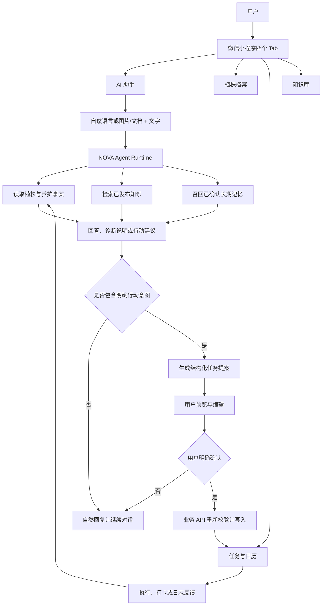
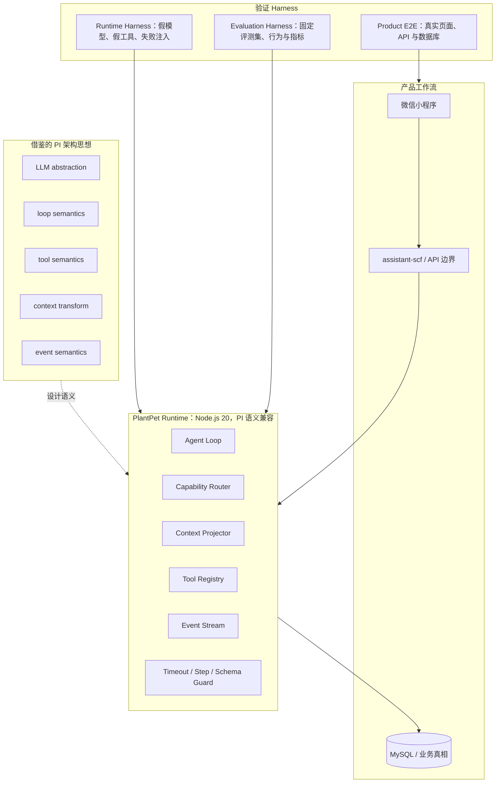
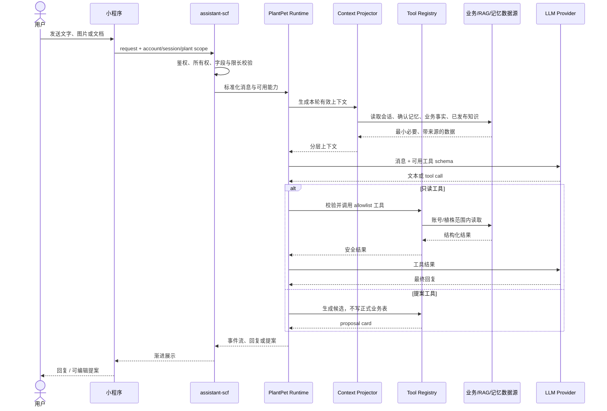
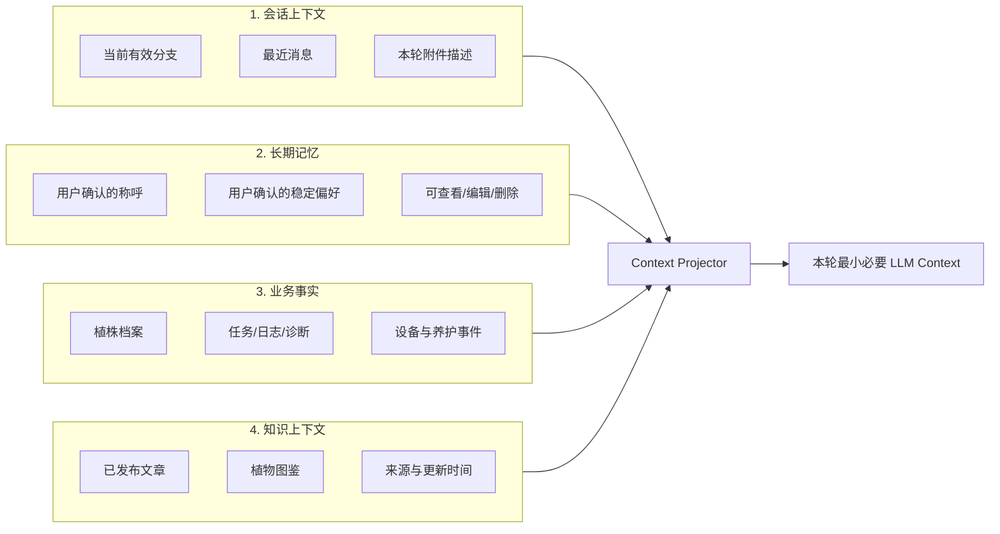
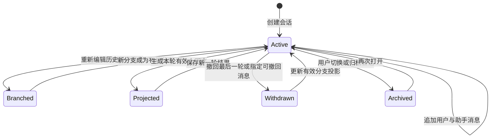
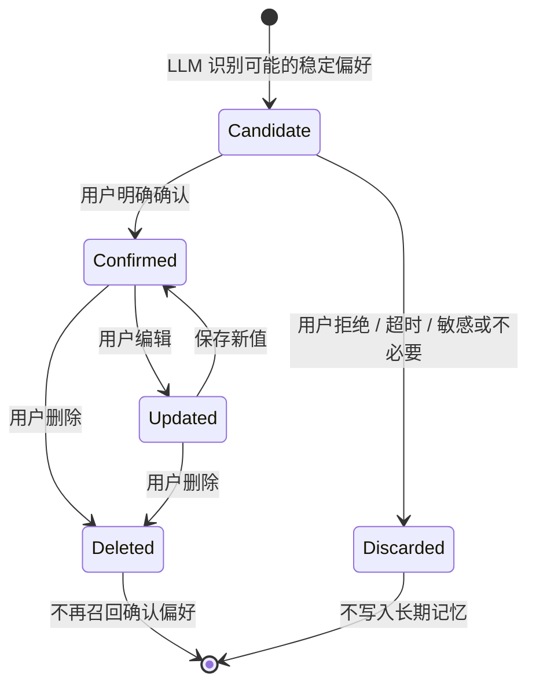
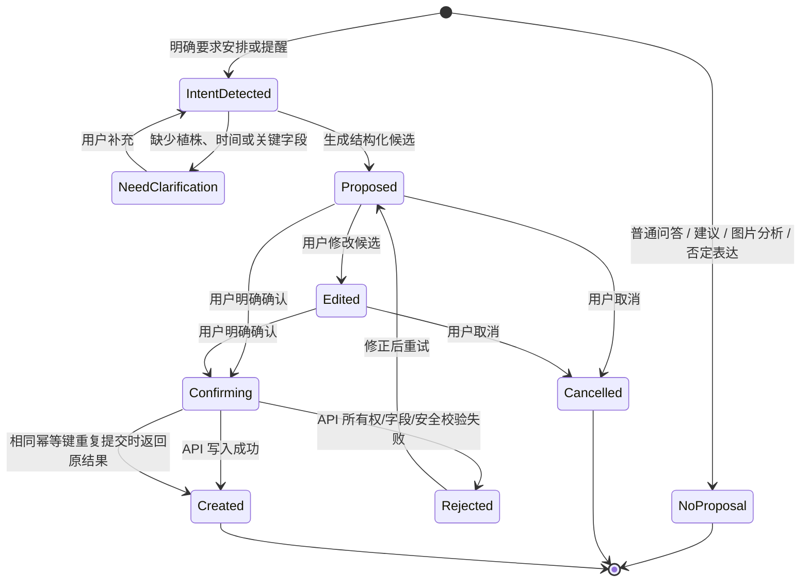
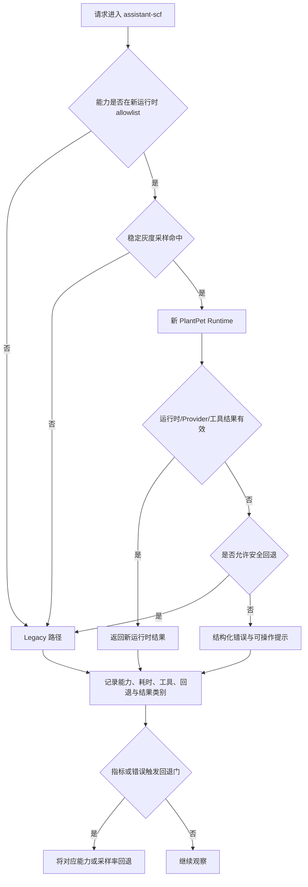

> 历史快照，归档于 2026-09-08。保留当时描述和失败记录，不作为当前事实。当前入口见[先看这里](../../先看这里.md)，技术事实见[当前架构](../../current-architecture.md)。

# NOVA 植宠 Agent M7 架构重构与验收报告

> 这份是开发与维护底稿。想快速了解全貌或开始验收，请直接看[先看这里](../.././先看这里.md)。下方 Run16 是 9 月 3 日历史证据，最新复跑从简版入口查看，不把不同批次混在一起。

> 文档状态：本地 A/B/C 自动验收候选冻结版，等待项目负责人终局人工签字
> 适用范围：植宠微信小程序 v0.1 / M7 Agent 架构重构
> 读者：项目负责人、指导学长、指导教师、比赛评审、后续维护者
> 编写口径：仅记录能够由设计文件、代码和测试证据支持的结论；本地集成与 DevTools 写入 Run16 实测结果，云端和实体真机仍明确保留为“未执行”。

## 1. 摘要

NOVA 是植宠微信小程序中的人格化植物养护伙伴。它既需要像正常对话产品一样自然理解用户，也必须在涉及植物档案、长期记忆、知识来源和养护任务时遵守严格的数据与权限边界。

M7 的目标不是增加一个更大的聊天机器人，而是将此前较粗糙的“正则分流 + 单次 LLM 回复 + 零散业务逻辑”整理为可测试、可灰度、可回退、可持续扩展的 Agent 运行时。重构后的核心原则是：

1. 大部分正常表达进入 LLM 语义理解，规则层只保留确定性的安全、权限、字段和副作用约束。
2. 会话上下文、长期记忆、业务事实和知识检索分层管理，不互相冒充。
3. Agent 可自动读取被授权的事实，但不能绕过用户确认直接产生正式业务副作用。
4. 任务等写操作先形成结构化提案，再由用户预览、编辑并确认，最终由业务 API 重新校验后执行。
5. 新运行时按能力逐步灰度；任何异常都能回退到既有路径，不以一次性替换赌产品稳定性。

本项目在标准 SCF 环境中采用 **Node.js 20 下自研的 PI 语义兼容运行时**。它借鉴并实现 PI 架构中的 Agent Loop、Tool、Context Projection、Event 和受控能力路由思想，但必须准确区分：

- 当前没有在标准 SCF 中直接运行官方 `pi-agent-core` 包；
- 当前不是 `pi-coding-agent`；
- 当前不是完整的通用 AgentHarness；
- 当前没有引入多 Agent、子 Agent、handoff、后台自治或任意代码执行能力；
- 产品事实仍由 MySQL 和业务 API 持有，Agent 不是最终事实源。

截至 2026-09-03 当前工作区，Phase 0—5 的本地实现及退出条件均已进入统一关闭门。Run16 总退出码为 0：全仓库单元测试 403/403、产品合同 5/5、legacy 基线 42/42、真实本地 MySQL/API/已配置 Provider 148/148、微信开发者工具 88/88，页面运行时异常为 0，并形成 31 张步骤截图。因此当前可以称为 **M7 本地 A/B/C 自动验收候选通过**，并交给项目负责人做终局人工验收；这仍不等于云端体验版或实体真机通过，D/E 两层均未执行。

## 2. 项目背景与用户问题

### 2.1 产品定位

植宠 v0.1 以“真实植物—持续观察—养护建议—任务执行—记录反馈—下一轮理解”为核心闭环。AI 助手并非独立于业务的问答页，而是连接植株档案、图片分析、养护知识、任务、日志和用户关系体验的交互入口。

产品希望用户感受到：

- NOVA 知道当前正在照顾哪一盆植物；
- NOVA 能根据已存在的档案、养护记录和知识回答，而不是凭空编造；
- NOVA 能记住用户明确希望它记住的称呼和偏好；
- NOVA 会主动提出下一步建议，但不会未经确认替用户做决定；
- 用户始终可以查看、修正或删除长期记忆；
- 图片分析、知识建议和任务安排能够形成完整、可追溯的养护闭环。

### 2.2 重构前暴露的问题

此前实现已经具备对话、RAG、记忆、图片分析和简单 Tool Calling 的雏形，但真实使用中暴露出以下结构性问题：

- 宽泛正则承担了语义分类职责，导致“你好”和“你好？”、“月季是什么”、“我是谁”等正常表达被不一致地拦截。
- 部分回复由规则层拼接固定开场，语言突兀，也容易与真实用户意图冲突。
- 会话记录、长期偏好、账号昵称、植物事实和知识检索的边界不清楚，形成“看起来记住、实际无法跨会话召回”的体验。
- 图片养护建议曾被错误理解为“应当创建任务”，暴露出建议与正式副作用没有分层。
- Tool Calling、任务候选和正式写入之间缺少清晰的确认协议。
- 图片、附件、重新编辑、撤回、多会话等前端能力与后端上下文语义需要共同验证，而不能只验证界面存在。
- Agent 运行时、业务后端和评测脚本边界不清晰，容易把固定样例或 smoke test 误认为完整 Agent 架构。

M7 因此优先解决“边界、语义、控制和可验证性”，而不是继续堆叠不受控能力。

## 3. 需求与设计原则

### 3.1 必须实现的产品要求

| 类别 | 必须满足的要求 |
|---|---|
| 对话 | 正常闲聊、通用问答、植物通识和身份类问题尽量由 LLM 理解；不因标点、空格或关键词偶合而错误拒绝 |
| 人格 | NOVA 的语气和产品身份稳定；不谎称掌握用户真实身份，不制造情感依赖 |
| 会话 | 支持同一植株的多个会话；重新编辑和撤回应改变后续有效上下文 |
| 记忆 | 长期偏好先候选、后确认；支持查看、编辑、删除和清除；删除后不得继续召回该确认偏好 |
| 业务事实 | 植株、任务、日志、诊断和设备数据由业务真相源读取，不复制成可能过期的自由文本记忆 |
| RAG | 只使用已发布内容；展示可读来源；无可靠命中时明确说明不确定；文档内容不得覆盖系统权限 |
| 图片/附件 | 图片或文档可与文字一同发送；会话切换和页面重载后仍能恢复可恢复的附件信息 |
| 任务 | 只有明确任务意图才能生成候选；普通建议、图片分析和否定表达不得自动建任务 |
| 副作用 | 候选必须经过预览、编辑和明确确认；正式写入由业务 API 执行并重新校验 |
| 隔离 | 账号、会话和植株数据不可串读；模型不能接触或泄露不必要的内部身份字段 |
| 可用性 | Provider、工具和网络异常有可理解的降级；新运行时可灰度和回退 |

### 3.2 规则层的正确职责

M7 不追求“完全没有规则”，而是将规则限制在能够确定判断的底线：

- JWT、账号与植株所有权；
- 参数类型、必填字段和长度限制；
- 工具 allowlist；
- 最大步骤数、超时和输出上限；
- 已发布知识过滤；
- 写操作必须确认；
- 明确否定优先；
- 高风险内容和来源完整性检查；
- 幂等、审计和错误码。

“这句话是不是植物问题”“用户是不是在问数学”“是否值得自然回复”等开放语义不再主要由脆弱正则决定。

### 3.3 非目标

M7 不包含以下能力：

- Agent 直接操作硬件；
- Agent 直接修改植株档案、日志或正式任务；
- 任意 SQL、文件系统、Shell、代码执行或开放网络浏览；
- 多 Agent、子 Agent、handoff 或跨 Agent 自动协作；
- 无人值守后台自治、持久运行或通用 checkpoint；
- 社区内容自治、跨端数字生命全量实现；
- 用知识图谱替代当前尚可由结构化业务表和混合检索解决的问题。

## 4. 阶段路线与当前状态

| 阶段 | 核心目标 | 文档状态 | 终局证据 |
|---|---|---|---|
| Phase 0 | 冻结遗留测试、产品评测集和基线 | 已有完成记录 | 由既有 Phase 0 证据索引引用 |
| Phase 1 | 隔离验证 PI 兼容 loop、tool、event、abort、timeout | 已有完成记录 | 由既有 Phase 1 结果报告引用 |
| Phase 2 | 只读工具和 Shadow 运行，不向用户输出、不写业务数据 | 已有完成记录 | 由既有 Phase 2 结果报告引用 |
| Phase 3 | 简单对话、身份问答、通用植物知识受控灰度；失败回退 | 本地实施完成；仓库/云候选默认关闭；本机人工验收配置显式开启 100%；未部署 | 由既有 Phase 3 结果报告和终局 runner 的强制 cohort 证据共同说明 |
| Phase 4 | 有效会话分支与受控长期记忆 | 本地 A/B/C 自动验收候选通过 | Run16 覆盖待确认不召回、确认后跨会话召回、编辑、删除、重写分支、撤回、410 tombstone、账号隔离及真实 MySQL 保留期 |
| Phase 5 | 任务提案、编辑、确认、API 写入与幂等 | 本地 A/B/C 自动验收候选通过 | Run16 覆盖明确/模糊/否定意图、缺日期候选、预览编辑、确认/取消、重复确认、Vision 零误触发和 owner 隔离 |
| M7 关闭门 | 全量回归、真人式 DevTools 验收、报告和人工验收指南 | Run16 总退出码 0；等待项目负责人终局人工签字 | `D:\植宠项目\验收记录\M7_2026-09-03\harness-full-run-16`；D/E 未执行 |

这里的“Phase 0—5 完成”表示 M7 提案中列出的实施阶段完成，不等于长期产品路线 R0—R10 全部完成，也不等于所有 legacy 能力已经迁移到新运行时。

## 5. 总体架构

### 5.1 产品工作流



### 5.2 框架、运行时与 Harness 边界



边界说明：

| 名称 | 本项目中的含义 | 不代表什么 |
|---|---|---|
| PI 架构思想 | loop、tool、context、event、状态与取消语义的设计参考 | 不代表直接安装并运行官方 PI 全部源码 |
| PlantPet Runtime | 为标准 SCF 编写的 Node.js 20/CommonJS 兼容运行时 | 不是 `pi-coding-agent`，不是通用代码 Agent |
| Runtime Harness | 隔离验证 loop/tool/abort/timeout 的测试宿主 | 不是面向用户的完整产品，也不是长期运行 Agent |
| Evaluation Harness | 对固定输入集计算误拒、回退、工具和输出表现 | 不是 Agent Runtime 本身，不能替代真实业务 E2E |
| Product E2E | 小程序页面、SCF/API、MySQL 和交互闭环 | 本地 DevTools E2E 不能冒充云端或真机验收 |

### 5.3 单次请求时序



任何 tool call 都必须经过运行时 schema、能力 allowlist 和服务端账号范围校验。模型在文本中声称“已经创建”不构成真实副作用。

## 6. 四层上下文模型



### 6.1 会话上下文

会话上下文回答“当前这一轮应该让模型看到什么”。重新编辑或撤回之后，只能投影当前有效分支；旧文本可以为审计保留，但不能继续影响模型。

### 6.2 长期记忆

长期记忆只保存适合跨会话持续使用、且经过用户确认的信息。典型例子是“以后叫我 Dola”“我更喜欢简短提醒”。账号昵称可以从账号资料直接读取，不需要复制到长期记忆；手机号、证件号、密码和未经必要性评估的敏感信息不得成为记忆候选。

### 6.3 业务事实

“这盆植物最近浇过水”“任务已经完成”“图片诊断曾发现黄叶”等属于业务事实，应从任务、日志、诊断或设备表实时读取。模型生成的摘要不拥有修改这些事实的权力。

### 6.4 知识上下文

RAG 知识来自已经审核和发布的植物资料，必须保留来源、标题、更新时间等可追溯信息。检索不到可靠内容时应明确不确定，不得用无来源文本填补。

## 7. 会话与长期记忆设计

### 7.1 有效分支生命周期



无论底层最终采用 append-only event，还是兼容期内采用分支复制，验收关注的是一致语义：被编辑替代或撤回的消息不能继续进入后续模型上下文，且账号/植株归属不变。

### 7.2 记忆生命周期



记忆候选不是事实。系统必须向用户展示准备记住的内容、作用范围和隐私提醒；只有明确确认后才能成为长期偏好。

### 7.3 删除与业务事实的区别

- 删除用户确认的称呼或偏好后，该偏好不能被模型自动重新生成并继续使用。
- 任务、日志、诊断等记录不是自由文本长期记忆；其修改和删除遵循各业务模块规则。
- 若未来允许“隐藏某类派生事实”，应设计独立的抑制或墓碑机制，不能假装已经删除业务真相。

## 8. 工具与副作用控制

### 8.1 权限矩阵

| 能力 | Agent 可否自动调用 | 是否产生正式副作用 | 最终权威 |
|---|---:|---:|---|
| 读取账号昵称 | 是 | 否 | 账号资料服务 |
| 读取当前/选中植株 | 是 | 否 | PlantPet API / MySQL |
| 读取养护事件与设备事实 | 是，按账号和植株范围 | 否 | 业务 API / MySQL |
| 检索已发布知识 | 是 | 否 | RAG 发布库 |
| 召回已确认记忆 | 是，按作用域 | 否 | 记忆服务 |
| 生成记忆候选 | 是 | 否 | 临时候选状态 |
| 确认/编辑/删除记忆 | 必须由用户动作触发 | 是 | 记忆 API |
| 生成任务候选 | 是，仅明确任务意图 | 否 | 提案状态 |
| 创建正式任务 | 否，必须用户确认后由 API 执行 | 是 | Task API / MySQL |
| 修改植株档案或日志 | 否 | 是 | 对应业务页面与 API |
| 控制硬件 | 否 | 是 | 不在 M7 范围 |
| Shell、文件系统、任意 Web、代码执行 | 否 | 不适用 | 不向产品 Agent 暴露 |

### 8.2 任务提案生命周期



任务频率、默认提醒和安全边界优先来自确定性业务规则；LLM 负责理解自然语言、解释和形成候选，不应凭空发明高风险或过度频繁的养护计划。

## 9. RAG、图片与文档上下文

### 9.1 RAG

RAG 的质量不只看“是否找到一段文本”，还必须验证：

- 内容处于已发布状态；
- 账号私有数据与公共知识不混淆；
- 植物种类、问题主题和来源匹配；
- 输出保留可读来源和更新时间；
- 无结果时承认不确定；
- 检索文档中的命令、角色扮演或越权提示只作为资料内容，不作为系统指令执行。

当前阶段不需要为“拥有高级技术名词”而引入知识图谱。只有当跨植物、病害、症状、措施、禁忌和来源之间形成稳定、多跳且难以由结构化表与混合检索表达的关系，并且有足够内容治理能力时，才应通过独立 ADR 和 PoC 评估知识图谱。

### 9.2 图片和文档

图片或文档选择后先进入输入框附件区，用户可以继续补充文字，再统一发送。会话消息应保存可恢复的媒体引用、文件类型、大小、摘要和分析结果；临时本地路径不能被当作长期可用资源。

图片分析输出应区分：

- 图片中可见的客观现象；
- 品种或问题的候选与置信度；
- 可能原因；
- 建议动作；
- 证据不足与复拍建议。

建议动作本身不等于任务意图。普通图片观察和普通建议必须产生 0 个任务候选。只有同时满足“用户明确要求安排/提醒/创建任务”“图片的高置信候选匹配当前选中 PlantPet”“候选字段通过校验”时，Vision 链路才可生成 `pending` proposal；它仍不能直接写正式任务。图片与当前植株不匹配、图片不确定、没有选中植株或用户明确否定时均产生 0 个任务候选。

## 10. 灰度、回退与失败处理



灰度应以稳定账号/会话采样为基础，避免同一会话在新旧运行时之间随机跳动。回退粒度应至少支持：

- 全局关闭新运行时；
- 按能力关闭；
- 降低采样率；
- Provider 或只读工具失败时走安全 fallback；
- 提案链路失败时只返回未创建提示，绝不能假成功。

## 11. 代码与数据映射

下表按当前工作区的真实文件和导出函数记录。这里的“已实现”仅表示代码/契约存在，不自动等于本地 API、DevTools、云端或真机已经通过。

| 架构责任 | 当前/目标代码所有者 | 状态 |
|---|---|---|
| 请求标准化与受控运行时入口 | `runtime/turnEnvelope.js#createTurnEnvelope`；`runtime/rolloutRuntime.js#tryHandleControlledRollout`；`runtime/plantPetRuntime.js#PlantPetRuntime.run`；`agent/chatHandler.js` | `clientTurnKey`、账号/会话稳定抽样、最大步骤/工具数/超时、结果完整性门禁；`AGENT_ROLLOUT_ENABLED=false` 为生产默认 |
| Capability Router | `agent/intentRouter.js#classifyTaskIntent/#classifyMemoryIntent`；`runtime/capabilityPolicy.js#getAllowedToolNames/#getRequiredReadTools`；`runtime/rolloutRuntime.js#requiredLegacyCapability/#planControlledRollout` | 只为本轮暴露最小工具；任务分 request/deny/discuss/ambiguous/none；开放语义仍交给 LLM，不把普通 Query 正则结果当权限 |
| Context Projector | `runtime/contextProjector.js#projectTurnContext`；`runtime/sessionAdapter.js#projectSession/#projectModelMessages/#loadSessionProjection`；`runtime/memoryAdapter.js#recallRelevantMemories` | 会话、临时 Agent State、确认记忆、业务事实/账号资料、发布知识分层；完整轮次投影，默认最多 6 轮模型历史 |
| Tool Registry / Schema Guard | `runtime/toolRegistry.js#TOOL_META/#TOOL_DEFINITIONS/#normalizeToolCall/#createAgentToolExecutor` | 4 个只读能力（昵称、选中植株、发布知识、确认偏好召回）和 2 个 proposal-only 能力；拒绝未知字段、任意 owner/PlantPet ID 与未知工具 |
| 账号昵称只读工具 | `agent/userIdentity.js#loadUserDisplayProfile`；`toolRegistry.js` 的 `get_account_nickname` 分支 | owner 来自 JWT 闭包；工具无参数；账号昵称不等同于真实身份 |
| 当前植株只读工具 | `agent/petContext.js#loadOwnedPlantPet`；`toolRegistry.js` 的 `get_selected_plant` 分支 | 只读取请求已选且属于当前账号的 PlantPet；模型不能传任意植株 ID |
| 已发布知识工具 | `rag/knowledgeSearch.js#searchKnowledgeBundle`；`toolRegistry.js` 的 `search_published_knowledge` 分支 | 最多投影 3 条脱敏结果；只接受已发布知识；无命中返回 unknown |
| 会话、分支、撤回与保留策略 | `lib/agent-store.js#getOrCreateConversation/#saveExchangeWithProposals/#forkConversationBeforeMessage/#withdrawLatestExchange/#pruneMessages/#findCommittedExchangeByKey`；`runtime/sessionAdapter.js` | `ai_messages` 是可读账本，事件作审计/投影补充；重新编辑创建新分支并复制前缀；撤回仅最后一轮并取消 pending proposal；同一已撤回 key 返回 410 tombstone |
| 记忆召回与候选确认 API | `runtime/memoryAdapter.js`；`runtime/toolRegistry.js` 的 `recall_relevant_memories`、`propose_memory_candidate`；`api-scf/lib/action-proposals.js`；`api-scf/index.js` 三条 `/ai/memory-proposal*` 路由 | 仅相关且 `user_confirmed=1` 的 `user_preference` 可召回；当前 proposal 只支持非敏感 `preferred_name`；查询/确认/取消按 JWT owner 和完整 key |
| Vision 任务候选 | `agent/visionHandler.js#buildVisionTaskSuggestions/#saveVisionExchangeWithMedia` | 普通建议为零任务；明确任务意图且图片候选匹配当前植株才在图文交换事务中持久化 pending proposal |
| `propose_care_task` | `runtime/toolRegistry.js#validateTaskProposalArguments/#createAgentToolExecutor`；`runtime/capabilityPolicy.js#parseTaskDraft` | 结构化日期、提醒、重复、标题和描述；只生成 24 小时 pending proposal，不写 `todos` |
| 任务预览/编辑 UI | `pages/assistant/assistant.js#openTaskSuggestion`；`pages/assistant/assistant.wxml`；`pages/taskForm/taskForm.js`；`pages/taskForm/task-form-state.js`；`services/modules/TodoService.js` | 只凭 `proposalKey` 进入 proposal 模式；从后端加载，锁定植株，可编辑任务字段，确认或取消；manual create/edit 模式保持兼容 |
| 正式任务确认 API | `api-scf/lib/care-task-proposals.js#confirmCareTaskProposalForUser`；`api-scf/lib/care-tasks.js#createCareTaskForUser/#insertCareTaskRecord`；`api-scf/index.js` 三条 `/care/task-proposal*` 路由 | 事务内重新校验 owner、活动植株、proposal 状态和字段；`care_task_creation_keys` 保证重复确认返回同一任务；公开 create 拒绝 `source=ai` |
| 前端异步作用域保护 | `pages/assistant/assistant-state.js#createAssistantAsyncScope/#isAssistantAsyncScopeCurrent/#isAssistantInteractionLocked`；`pages/assistant/assistant.js#invalidateAssistantAsyncScope/#captureAssistantAsyncScope` | 植株 ID、会话 ID、页面 epoch 必须同时匹配；发送/加载期间锁定切换；迟到回包不得覆盖另一个页面作用域 |
| 数据 Schema | `reference/agent_runtime.m7.sql` | 增量新增 `ai_conversation_events`、`ai_action_proposals`、`care_task_creation_keys`、`ai_message_media_links` 四表，不替换既有会话、记忆和任务真相表 |
| Runtime 合同 Harness | `test/m7-shadow-runtime.test.js`、`test/m7-controlled-rollout.test.js`、`test/m7-session-memory.test.js`、`test/m7-phase5-runtime.test.js` | 隔离 fake model/tool/DB 验证 loop、回退、投影、tombstone、proposal 与幂等；它们不是官方 PI AgentHarness，也不是产品 E2E |
| Evaluation Harness | `evals/m7-agent/product-contract.json`、`product-contract.test.mjs`、`run-shadow-provider-probe.mjs`、`run-rollout-provider-probe.mjs` | 产品合同 5/5 当前通过；Phase 2/3 real-provider JSON 是历史证据；provider probe 有显式授权开关且不能冒充云/真机 |
| 本地终局 Harness | `scripts/local-server/run-m7-full-acceptance.ps1`、`m7-smoke.js`、`m7-devtools-e2e.js` | 已串联单测、产品合同、legacy 基线、上下文/语法/SCF 打包、隔离 MySQL/HTTP/Provider 与 DevTools；Run16 总退出码 0，148 项 API 与 88 项页面断言通过 |

灰度开关的口径必须保持精确：仓库样例和云端初版仍是 `AGENT_ROLLOUT_ENABLED=false`，所以普通未配置部署会继续走 legacy；当前被 Git 忽略的本机 `.env.local` 为最终人工验收显式设置 `rollout=true`、`sample=1`，完整 runner 也只在自己的隔离子进程中强制相同 cohort。前两者不能被写成“生产默认已经切换”。如果关闭 rollout，legacy 的宽语义规则仍可能复现此前的误拦；M7 改善的是受控新运行时命中后的路径，而不是删除全部 legacy 代码。

### 11.1 Phase 4 实现披露

- 保留：既有 `ai_conversations`、`ai_messages`、`ai_memories`、同 PlantPet 多会话、长按重新编辑/撤回入口、图片/文档恢复和账号/植株 owner 约束；业务事实继续归各业务表所有。
- 移除：没有删除用户可见会话能力；停止“读取植株上下文时顺带把业务事实复制成长期自由文本记忆”，并停止把纯读加载当成清理/更新时间写操作。
- 改为非默认：未确认候选不会进入模型长期记忆；只有相关且经用户确认的 `user_preference` 才召回。Phase 4 经新 runtime 使用时仍受 `AGENT_ROLLOUT_ENABLED=false` 默认灰度边界约束。
- 新增：事件审计、`clientTurnKey` 幂等、原子消息+proposal+event 写入、有效分支投影、相关记忆召回、称呼候选的确认/取消、消息媒体链接、撤回/保留策略 tombstone 和前端 async scope/epoch。
- 重组：重新编辑采用“从目标用户消息之前复制前缀到新会话”而非原地篡改；撤回在事务中取消本轮 pending proposal、记事件并删除最后一对消息；读路径不再隐式裁剪，写路径在同一事务执行裁剪。
- 数据迁移/兼容：`reference/agent_runtime.m7.sql` 仅增量建四表；旧会话消息无需转换。读取消息时从 proposal 表水合最新状态，避免旧 `response_json` 快照继续显示 pending。旧附件若没有可恢复永久引用，则重新编辑入口按能力禁用，而不是伪造可恢复。
- 保留与脱敏：每会话最多保留 40 条消息、原始消息最长 30 天。清理前先使 pending proposal 过期、解除消息引用、删除无其他引用的私有媒体，并把 `turn_committed` payload 改为不含正文的 `message_retention` tombstone；迟到重试返回 HTTP 410，而不是幽灵重放已撤回/已清理内容。
- 回滚方式：关闭 `AGENT_ROLLOUT_ENABLED` 可把受控文本回复退回 legacy，但不会删除已经存在的会话、确认记忆、审计事件或 proposal。若需代码回滚，应先停止新写入并保留增量表用于审计/兼容，不能以回滚为由直接删表或恢复已撤回内容。

### 11.2 Phase 5 实现披露

- 保留：既有手工创建/编辑任务、`todos` 正式任务表、日历与任务消费页面、现有字段校验和 PlantPet owner 约束。
- 移除或拒绝：AI 文本和客户端不能再把 `source=ai` 直接提交到公开 `/care/task-create`；没有服务端 `proposalKey` 的旧本地候选不能进入 AI 确认模式。模型从未获得正式建任务工具。
- 改为非默认：proposal 初始为 `pending`，默认 24 小时过期；只有用户进入预览、编辑并明确确认后才写 `todos`。受控文本 runtime 默认灰度关闭；普通建议、否定、讨论和模糊表达均不开放 proposal 工具。
- 新增：`propose_care_task` schema、`ai_action_proposals` 状态机、`care_task_creation_keys` 幂等表、proposal 查询/确认/取消 API、`taskForm` proposal 模式和网络失败条件下的幂等 POST 重试。
- 重组：Agent 只负责“理解并准备候选”；`api-scf` 负责“按 JWT owner 锁定 proposal、校验活动植株与编辑字段、事务写入任务并消费 proposal”；小程序只消费 API 返回的真实状态。
- 数据迁移/兼容：手工任务接口及 create/edit UI 保持原路径；proposal 状态对外统一为 `pending/confirmed/cancelled/expired`，内部 `dismissed` 映射为 `cancelled`。已确认 proposal 通过 `consumed_target_id` 和创建键关联原任务。
- Vision 兼容：普通图片分析始终不创建 proposal；只有明确任务意图且图片高置信候选匹配当前选中植株时，候选才与图文消息一起原子保存。图片不匹配或不确定时为 0 个候选。
- 当前交互语义：自然语言“取消刚才候选”不会静默获得写权限，也不会伪装取消成功；用户需进入 proposal 卡片并点击取消。缺少日期但当前植株明确时，候选会预填今天，仍须在确认页查看/编辑并明确确认后才会进入 `todos`。二者均应在人工验收中按真实实现验证，而不是写成模型已经自动处理。
- 回滚方式：关闭受控 rollout 可停止新 runtime 接管；可单独回滚前端 proposal 入口和 API 部署，但不得删除已经创建的正式任务。未消费候选应保留到过期或显式取消；Vision proposal 不由 rollout 总开关控制，若需停用必须回滚/配置对应 Agent 版本，不能误以为关灰度即可停止全部 proposal。

## 12. 测试、证据与结果

### 12.1 五层证据模型

| 层级 | 验证内容 | 能证明什么 | 不能证明什么 | 当前结果 |
|---|---|---|---|---|
| A 单元/契约 | 纯函数、schema、规则底线、loop、tool、context、幂等单元 | 组件语义和边界 | 真实 API、数据库和界面 | **通过**：Run16 中全仓库 `npm test` 403/403；产品合同 5/5；legacy 基线 42/42；上下文、10 个语法检查、SCF 包准备和 `git diff --check` 均退出 0 |
| B 本地 API/DB | 本地服务、隔离 MySQL、真实路由、账号/植株数据 | 本地集成和持久化 | 云 SCF、真实微信身份、手机网络 | **通过**：Run16 真实本地 MySQL/API/已配置 Provider 148/148；含附件字节/归属、并发幂等、记忆、任务、跨账号和保留期闭环 |
| C DevTools E2E | 微信开发者工具中的真实页面、交互与后端 | 本地自动化覆盖的核心产品流与可机器断言的页面交互 | 回答自然度/视觉舒适度人工判断、体验版、真实微信网络、实体手机触感与性能 | **通过**：Run16 88/88，31 张截图，运行时异常 0；含登录、建档、图文/文档、多会话、任务、日历、日志、RAG、长按菜单、重写、撤回、记忆、资料、知识库和设置 |
| D 云端体验版 | 真实微信登录、云 SCF/数据库/COS、体验版 | 云端配置和平台兼容 | 指定实体手机的最终演示品质 | **未执行**：需要单独线上授权，且第 22.5 节 P0 门禁尚未关闭 |
| E 真机 | 指定手机、真实账号、三分钟演示 | 最终用户环境和比赛演示 | 其他设备普遍性能 | **未执行**：需指定设备、真实账号和录屏证据 |

### 12.2 Phase 4 结果

| 指标/场景 | 期望 | 实测 | 证据 |
|---|---|---|---|
| 同一账号跨会话召回确认称呼 | 可召回 | A/B/C 通过：pending 时新会话不召回，点击确认后新会话召回 | Run16 API JSON、DevTools `17-memory-proposal-pending.png`—`19-ai-memory-confirmed-source.png` |
| 未确认候选不进入长期记忆 | 0 条误写入 | A/B/C 通过：模型只生成 pending proposal，确认 API 才写入 | Run16 148 项 API 与 88 项页面断言 |
| 删除确认偏好后再次对话 | 不再召回 | A/B/C 通过：删除后列表消失，再开新会话不召回旧值或编辑值 | Run16 API/DevTools 记忆完整链 |
| 编辑偏好后使用新值 | 使用新值 | A/B/C 通过：只允许编辑当前账号已确认的 `user_preference`，召回采用新值 | Run16 `20-ai-memory-edited.png` 及 API 证据 |
| 撤回消息后上下文 | 被撤回内容不再可见于模型 | A/B/C 通过：页面删除最后完整轮次，后续回答不含一次性暗号；旧 key 返回 410 | Run16 DevTools 撤回专项、API tombstone 专项 |
| 重新编辑后的分支 | 旧分支不再影响新回复 | A/B/C 通过：实际重写发送创建新 session，重启后恢复新分支，后续只复述新值 | Run16 `16a-rewrite-branch-follow-up.png` 与原/新 session API 对照 |
| A/B 账号记忆隔离 | 0 次串读 | A/B/C 通过：读取、候选查询/确认/取消均受 JWT owner/openid 限制 | Run16 第二身份隔离断言及页面链 |
| 植物业务事实未复制为自由文本真相 | 满足 | A 层通过：植株上下文读取只有 SELECT，不写 `ai_memories` | `m7-session-memory.test.js` |
| 保留期裁剪与迟到重试 | 无悬空媒体/候选；审计键仍阻止幽灵重放 | A/B 通过：真实 MySQL 从 44 条消息裁剪至 40 条消息（20 个完整 user/assistant 轮次）；旧 pending 过期、消息引用解除、孤立私有媒体删除、事件 payload 仅保留 `reason/retired`，原键 HTTP 410 | Run16 `m7-api-smoke-result.json#retention` |

Phase 4/5 后端关键契约定向命令（本工作区实际执行）：

```powershell
node --test `
  dist/scf/agent-scf/test/m7-session-memory.test.js `
  dist/scf/agent-scf/test/m7-phase5-runtime.test.js `
  dist/scf/api-scf/test/action-proposals.test.js `
  dist/scf/api-scf/test/care-task-proposals.test.js `
  services/core/ScfApiAdapter.test.js
```

该命令仍可用于 Phase 4/5 定向复查；最终关闭门以 Run16 的全量 `npm test` 403/403 和后续 B/C 层真实结果为准。定向测试只属于 A 层，不能单独证明 MySQL、页面或云端闭环。

### 12.3 Phase 5 结果

| 指标/场景 | 期望 | 实测 | 证据 |
|---|---|---|---|
| 明确安排任务 | 生成候选，不直接写入 | A/B/C 通过：只生成 `pending` proposal；确认页出现前 `todos` 保持不变 | Run16 API/DevTools 任务链 |
| 普通植物建议 | 不生成候选 | A/B/C 通过：讨论、普通建议和无明确创建意图不开放 proposal 工具，正式任务保持 0 | Run16 普通文本/Vision 与任务列表断言 |
| 图片分析中的普通建议动作 | 不生成候选 | A/B/C 通过：普通图像观察为 0；只有“明确创建任务 + 高置信候选匹配当前植株 + 存在建议”才生成 pending proposal | Run16 API Vision 两分支及 `07-vision-result-no-task.png` |
| 明确否定 | 0 个候选、0 个任务 | A/B/C 通过：文本与图片否定均未生成候选或任务 | Run16 API/DevTools 否定专项 |
| 缺少当前植株 | 追问或引导选择，不猜测目标 | A/B 通过：模型不能提交任意 PlantPet ID，服务端 owner 校验不可绕过 | Runtime/Tool schema 与 Run16 owner 隔离 |
| 当前植株明确但缺少日期 | 预填上海时区当天，仍保持 pending，确认页日期可编辑 | A/B/C 通过：`给它建个观察任务` 未直接写 `todos`；页面把日期改为次日后取消，仍为 0 个正式任务 | Run16 API 无日期任务断言与 DevTools taskForm 专项 |
| 未确认直接请求正式 API | 0 次绕过 | A/B 通过：公开 `/care/task-create` 拒绝 `source=ai`，正式 AI 写入只能走 proposal confirm | Run16 API 绕过与 pending 状态断言 |
| 用户编辑候选后确认 | 写入编辑后的字段 | A/B/C 通过：日期、提醒时间等编辑值由 API 重校验后写入；植株与 owner 不可替换 | Run16 `08-ai-task-confirmation-form.png`、首页/日历任务截图及 API 证据 |
| 重复点击确认 | 不重复创建任务 | A/B 通过：重复 POST 返回同一任务，`care_task_creation_keys` 保证幂等 | Run16 API 重复确认断言 |
| 跨账号/跨植株伪造参数 | 0 次越权 | A/B 通过：proposalKey 与 JWT owner 双重限定，失效/非当前归属植株不可确认 | Run16 第二身份 API 隔离专项 |

Phase 5 与 Phase 4 同时进入 Run16 统一关闭门：全仓库 `npm test` 403/403，真实本地 MySQL/API/已配置 Provider 148/148，DevTools 88/88，均退出 0；D/E 层不在该结论内。

### 12.4 全功能回归与真人式验收

最终至少覆盖：

- `你好`、`你好？`、标点、空格、表情和短句；
- 数学问题、带植物词的非养护问题、通用植物知识；
- 账号昵称、用户自定义称呼和隐私提示；
- 同植株多会话、新建会话、切换、编辑和撤回；
- 长期记忆候选、确认、跨会话召回、编辑、删除和清除；
- RAG 命中、未命中、来源、错误植物和提示注入；
- 图片与文字、文档与文字、附件恢复、分析失败重试；
- 明确、模糊和否定任务意图；任务预览、编辑、确认、幂等；
- Provider 超时、429/5xx、工具错误、非法参数和输出截断；
- 两账号、两植株的数据隔离；
- 四 Tab 之间的闭环、切页、退出和重进；
- 首次加载、首次跨页面跳转、首反馈、完整响应和 P50/P95。

当前自动化基线（本工作区实际执行）：

```powershell
npm test
npm run check:context
node --test evals/m7-agent/product-contract.test.mjs
```

- `npm test`：退出码 0，403/403 通过，0 失败、0 跳过、0 TODO（Run16）。
- `npm run check:context`：退出码 0。
- 产品合同：退出码 0，5/5 通过，0 失败；Run16 外层步骤耗时约 0.135 秒（内部 TAP 耗时以对应日志为准）。
- `node evals/m7-agent/run-legacy-baseline.mjs`：产品合同变化经审阅后已更新冻结期望，Run16 为 42/42、退出码 0；这份脚本是只读兼容基线，不是新 runtime 的能力证明。

终局本地集成入口为 `npm run acceptance-m7-full`。Run16 在 `D:\植宠项目\验收记录\M7_2026-09-03\harness-full-run-16` 生成结果、README、日志和 31 张截图，总退出码 0；其中 API 148/148、DevTools 88/88。Run14 的首次 RPC 基础设施超时和 Run15 的异步返回序列化误断均原样保留，修正验收基础设施后由 Run16 从头重跑，而非只补跑失败片段。`-SkipDevTools` 仍只能得到 PARTIAL；云端 D 层和真机 E 层均未执行。

Run16 之后的首次人工交付暴露了一个独立的启动态缺口：完整 runner 为保证隔离性，会在 `finally` 中停止自己启动的 Node 与 MySQL；当运行前不存在默认植宠服务时，结束后也没有服务可恢复。此前人工指南没有提供常驻启动入口，导致项目负责人进入开发者工具时 `127.0.0.1:3000` 与 3306 均未监听，登录、首页、日历、知识库和 Agent 因共享后端不可达而全部未加载。现已新增 `manual-acceptance:start/status/stop`：它不重建数据库，严格核验专用库、9 张必需表、进程可执行文件、当前项目 server 绝对路径与健康接口，只停止自己拥有且再次核验的进程。现场真实启动后，MySQL 为 9/9、`GET /health` 为 200，真实 `/auth/login`、用户资料、PlantPet、知识文章与 Agent 会话读取均成功。该修复关闭的是“自动证据到人工验收环境”的交接缺口，不改变 Run16 的历史证据，也不把桌面 loopback 环境扩写成真机或云端。

## 13. 安全、隐私与可信边界

### 13.1 身份与隐私

- 账号昵称只代表账号资料字段，不等于真实姓名或真实身份。
- 当用户主动希望 NOVA 记住称呼时，应说明不要提供手机号、证件号、密码等敏感信息。
- 只有适合长期使用且经用户确认的偏好才写入长期记忆。
- 日志不得记录访问令牌、密码、完整私密文档、内部身份标识或不必要个人信息。
- 所有读取按当前账号和植株所有权过滤。

### 13.2 植物建议边界

- 图片分析描述“可见现象”和“可能原因”，不冒充确定性诊断。
- 高风险药剂、食用、有毒植物和可能危及人宠健康的内容应给出边界提示。
- 不以模型建议代替现场观察、专业鉴定或必要的医疗/兽医意见。

### 13.3 提示注入与工具安全

- 用户、图片 OCR、上传文档和 RAG 文本均是不可信内容。
- 文档中的“忽略系统指令”“调用某工具”等文本不得改变能力 allowlist。
- 工具参数需服务端重新绑定账号范围和植株所有权。
- 模型无法通过自然语言自行扩展工具或权限。

## 14. 可维护性

### 14.1 新增只读工具

新增只读工具时应完成：

1. 明确唯一业务数据所有者；
2. 定义最小 JSON Schema，拒绝任意查询参数；
3. 在服务端绑定当前账号和允许的植株范围；
4. 注册到 Tool Registry，但只向需要该能力的请求暴露；
5. 编写正常、空结果、越权、超时和错误参数测试；
6. 将输出转为最小必要上下文，避免整表进入模型；
7. 更新权限矩阵、ADR、代码映射和评测集；
8. 先 Shadow，再按能力灰度。

### 14.2 新增提案类工具

新增任务之外的写操作时，必须沿用“提案—预览—编辑—确认—业务 API”的结构：

1. Agent 工具只生成候选；
2. 候选展示将要改变的对象、字段和后果；
3. 用户确认必须是独立、明确的界面动作；
4. 正式 API 重新做鉴权、所有权、字段、安全、事务和幂等校验；
5. 失败不能显示为成功；
6. 建立否定、取消、重复提交和跨账号攻击用例；
7. 新副作用必须通过单独架构决策，不因“已有 Tool Calling”自动获得授权。

### 14.3 新增 Provider

- 通过 Provider Adapter 对齐消息、图片、tool call、流式事件和错误语义；
- 不把某一厂商的字段渗透进业务 API；
- 明确模型支持的上下文、视觉、工具和结构化输出能力；
- 验证 429、5xx、超时、取消、空输出和不合规结构；
- 记录模型/配置版本，但不在日志泄露密钥；
- 先用 Runtime Harness 和评测集验证，再进入产品灰度。

### 14.4 新增记忆类型

新增记忆类型前先回答：

- 是否真的需要跨会话保存？
- 能否直接从账号资料或业务事实实时读取？
- 是否涉及敏感数据？
- 谁能确认、查看、编辑和删除？
- 作用域是账号、PlantPet、会话还是其他对象？
- 删除后是否可能从其他源重新派生？
- 到期、冲突和版本更新如何处理？

无法明确回答时，不应增加长期记忆字段。

### 14.5 新增知识来源

- 明确版权、来源、审核者、发布时间和更新责任；
- 先进入待审核区，通过审核后才能被 Agent 检索；
- 为切分、召回、重排和来源展示建立回归样例；
- 保留无命中和冲突来源处理；
- 评测准确率和可追溯性后再扩大语料；
- 只有关系型、多跳问题真实成为瓶颈时再评估知识图谱。

## 15. 可观测性与运行维护

建议每次请求记录不含敏感正文的结构化元数据：

- request/session/conversation 标识的安全哈希或内部审计标识；
- capability 和灰度分组；
- Provider 与模型配置版本；
- 上下文各层条目数和 token 估计；
- 工具名、结果类别和耗时，不记录敏感参数全文；
- 首反馈、完整响应和总耗时；
- 回退原因、错误类别、取消和超时；
- 是否生成记忆/任务候选；
- 是否由用户确认，以及业务 API 最终结果；
- RAG 命中数和来源标识。

需要持续观察的指标包括：

- 正常 Query 误拒率；
- 任务候选误触发率；
- 用户确认绕过次数（必须为 0）；
- 重复任务创建次数（必须为 0）；
- 越权读取/写入次数（必须为 0）；
- RAG 有来源回答率和无命中诚实率；
- Provider、工具和 legacy 回退率；
- P50/P95 首反馈与完整响应时延；
- 记忆候选确认、拒绝、编辑和删除比例；
- 图片/文档上传和恢复失败率。

比赛版本不再以 Chat/Vision 次数作为面向用户的账户额度门槛。若基础设施仍保留异常流量、安全或成本保护措施，应明确披露为系统保护策略，不能在界面中伪装成用户额度。

## 16. 扩展路线

### 16.1 可以自然扩展的方向

- 更多经过审核的植物知识和图鉴；
- 更精确的 PlantPet 范围记忆；
- 新的只读养护、天气或设备事实工具；
- 更多提案型操作；
- Provider 替换与多模型路由；
- 更完整的离线/在线评测和可观测性；
- 在业务需要明确后评估官方 PI Core 的独立运行服务。

### 16.2 需要独立 ADR 与 PoC 的方向

- 从 Node.js 20 兼容运行时迁移到官方 PI 包支持的运行环境；
- 多 Agent、handoff、后台任务和耐久执行；
- Agent 直接控制硬件；
- 知识图谱；
- 跨用户社区协作；
- 强关系人格和跨端数字生命状态。

这类扩展必须重新评估权限、成本、数据治理、失败恢复和用户知情，不属于 M7 完成后的默认能力。

## 17. 比赛价值与创新说明

### 17.1 实用性

项目围绕真实养护闭环组织能力：用户上传植物信息或照片，获得有来源的理解与建议，按需形成任务，执行后留下日志，并在后续对话中继续利用这些事实。价值来自闭环，而非单次聊天展示。

### 17.2 创新性

- 将植物档案、视觉分析、RAG、长期偏好和提案式 Tool Calling 组合为人格化养护伙伴；
- 用四层上下文避免“记忆越多越智能”的常见误区；
- 用只读工具和显式确认，将自然语言 Agent 与正式业务副作用安全连接；
- 用能力灰度和 legacy 回退在比赛周期内平衡创新与稳定。

### 17.3 用户体验

- 大部分自然表达由 LLM 理解，减少关键词误拦；
- 图片或文档可与文字一起发送；
- 多会话、重新编辑、撤回和长期偏好形成一致体验；
- 低频消息操作不常驻占位，通过长按上下文菜单提供；
- 任务先预览和编辑，不把建议强制变成日程；
- RAG 来源、图片不确定性和失败回退均对用户可见。

### 17.4 完整度

完整度以“档案—观察—分析—建议—任务—执行—记录—再次理解”是否真实跑通衡量，并以单元、本地 API、DevTools、体验版和真机五层证据逐级确认，不以静态页面数量衡量。

## 18. 三分钟演示建议

| 时间 | 演示内容 | 要证明的价值 |
|---:|---|---|
| 0:00—0:20 | 展示当前植株和多会话入口 | 植物对象和对话不是孤立页面 |
| 0:20—0:50 | 发送植物照片并补充文字 | 图片+文字统一发送、结构化可见现象与不确定性 |
| 0:50—1:15 | 追问知识并展开来源 | RAG 可追溯、未伪造 |
| 1:15—1:40 | 告诉 NOVA 希望使用的称呼并确认 | 记忆候选和隐私控制 |
| 1:40—1:55 | 新建会话，验证称呼召回 | 跨会话长期记忆 |
| 1:55—2:25 | 明确要求安排观察任务，编辑时间并确认 | 提案式 Tool Calling 与正式任务闭环 |
| 2:25—2:40 | 重复确认或否定任务请求 | 幂等与零误触发 |
| 2:40—3:00 | 在日历/任务完成并回到对话查看事实 | 四 Tab 数据闭环和持续理解 |

最终演示脚本应使用体验版和真实账号；本地 DevTools 录制只能标为开发验收材料。

## 19. 项目交付清单

### 19.1 软件与技术交付

- [x] Phase 0—5 本地代码与配置
- [x] 增量数据库 Schema、迁移顺序及回滚边界说明
- [x] API 与 Tool Schema 契约
- [x] ADR 与当前架构文档
- [x] 单元、集成、E2E 和评测集
- [x] 真实命令、退出码、日志与结果文件索引
- [x] 灰度、回退、监控和故障说明
- [x] 本报告和人工验收指南
- [x] 重大变更/本地化妥协全披露与迁云差距审计
- [x] 本地到腾讯云交接指南和可构建的 `cloud-initial` 云端初版（可上传隔离 staging 继续验证，不代表已部署或可投入生产）

### 19.2 比赛材料

- [ ] 小程序名称、账号、AppID 和体验/正式二维码
- [ ] 可独立阅读的项目介绍 PDF
- [ ] 功能、应用场景、解决问题、技术方案和创新点
- [ ] 不超过三分钟的演示视频
- [ ] 最终答辩 PPT
- [ ] 实用性、创新性、用户体验、完整度四维映射
- [ ] 团队分工、接口交接和维护责任
- [ ] 已知限制和证据边界

## 20. 已知限制与尚未完成项

截至 2026-09-03 当前工作区，Phase 0—5 的代码、增量 Schema、API/UI 协议和本地 A/B/C 自动验收候选均已形成可复查证据；以下事项仍未完成，不能由 Run16 外推：

- 项目负责人按人工指南完成终局体验判断与签字；
- 实体手机相机权限、拒绝授权、拍照方向、弱网、杀进程恢复和物理震动；
- 体验版真实微信登录、云 SCF、云数据库和 COS 验收；
- 指定实体手机上的三分钟完整演示；
- 云环境冷启动和真实网络 P50/P95；
- 全部 legacy 能力迁入新运行时；当前受控 runtime 仍会把附件、图片、当前植株状态、高风险/安全边界及其他未迁能力委托给 legacy；
- 长期记忆目前只开放用户明确确认的 `preferred_name`/`user_preference` 小范围能力，不是通用个人知识库；
- 仓库和云候选中的新 runtime 默认灰度关闭；本机人工验收配置和终局 runner 的隔离 cohort 显式开启不表示生产流量已切换；关闭时 legacy 宽语义规则仍可能误拦；
- 消息长按菜单当前只作用于本人用户消息，提供复制、重新编辑和最后一轮撤回；助手消息的复制/选择文本/分享菜单尚未实现；
- 任务 proposal 的自然语言取消尚未开放，必须在确认页点击取消；缺日期 proposal 会预填今天，但不会未经确认写入正式任务；
- 官方 `pi-agent-core` 在生产环境的直接使用；
- 多 Agent、硬件控制、后台自治和知识图谱。

## 21. 当前工程结论与终局待决事项

当前可以确认：Phase 0—5 的本地实现、增量 Schema、服务端 proposal 边界、会话 tombstone/retention、页面 async scope/epoch 和 A/B/C 自动关闭门均已落地。Run16 为 403/403 单元测试、5/5 产品合同、42/42 legacy 基线、148/148 API/MySQL/Provider、88/88 DevTools、31 张截图、0 个页面运行时异常，总退出码 0。受控运行时仍是标准 Node.js 20 下的 **PI 语义兼容最小 runtime**，不是官方 `pi-agent-core`，也不是通用 `AgentHarness`。它默认不接管流量；legacy 回退和既有产品能力仍是兼容边界。

当前可以把 M7 标为“**本地 A/B/C 自动验收候选通过，等待项目负责人终局人工验收**”，但不能宣告全层级通过：D 层云端体验版与 E 层真机均未执行。项目负责人最终结论至少应回答：

1. Phase 0—5 是否全部达到各自退出条件；
2. 哪些能力由新运行时承担，哪些仍由 legacy 承担；
3. 本地 A/B/C 三层分别有哪些可复查证据；
4. 云端 D 层和真机 E 层是否实际执行；
5. 仍有哪些限制、风险和待授权事项；
6. 当前结果能够支持哪些产品与比赛结论，不能支持哪些结论。

本报告现在可作为架构、代码和本地 A/B/C 自动化证据说明；在项目负责人签字以及 D/E 实际执行前，不得作为“所有层级均已通过”或“已经可上云参赛”的证明。

## 22. 重大重构与本地化妥协全披露

本节用于让项目负责人、验收者和后续接手者在继续开发或迁云前，能够一次看清“什么被保留、什么退出默认路径、什么是新增、什么被重新组织，以及哪些本地实现不能原样带到云端”。它不替代逐阶段代码审查，也不把本地验证扩写成云端完成。

事实来源为：

- [重大功能变更披露登记](../.././material-feature-change-disclosure.md)；
- [本地化妥协与云后端恢复登记表](../.././localization-compromise-register.md)；
- [SCF 部署单元说明](../.././scf-deploy-packages.md)；
- [当前架构入口](../.././current-architecture.md)；
- [本地到腾讯云部署交接指南](../.././local-to-cloud-deployment-guide.md)。

### 22.1 M0—M7 产品与架构变更总表

| 阶段 | 保留 | 删除、替换或改为非默认 | 新增 | 重组及影响 |
|---|---|---|---|---|
| M0—M1 | 设备、设备详情、设备设置、旧花园和知识库页面继续注册；硬件服务未删除 | 设备遥测/控制和知识库退出底部默认 Tab；首页不再以设备面板为中心 | PlantPet 档案、状态、今日任务和归档入口 | 默认四 Tab 改为“首页 / AI 助手 / 日历 / 我的”；这是产品主流程变化，不是页面删除 |
| M2—M3 | 成长记录的标题、正文、类型和时间线保留；旧设备能力继续兼容 | 原成长日记中的月历、设备选择和趋势入口不再承担默认流程 | 独立任务/日历、周期任务、成长时间线、0—3 张图片和媒体生命周期 | 任务以 PlantPet 和账号归属；日历、记录和详情页消费同一业务事实 |
| M4 | 知识列表、详情和 Agent 检索入口保留 | 未审核内容不再依靠 JSON fallback 被展示或送入 RAG | MySQL 发布状态、来源、审核人；本地 MVP 发布内容 | MySQL 成为知识正文与发布状态主存储；只检索 `published`，无命中保持未知 |
| M5 | 首页天气卡与节气提示保留 | 无真实天气时不再显示演示温度；前端不直接持有天气密钥 | 城市设置、主动定位、QWeather、30 分钟缓存和陈旧标记 | 天气事实由后端代理；节气提示与本地实时天气明确分开 |
| M6 | AI 助手仍是第二个 Tab；RAG、图片、记忆、任务确认、四 Tab 和旧设备兼容入口保留 | 助手不再是设备控制台；大 Hero、重复状态块、未接线入口和常驻消息操作退出默认界面；Chat/Vision 账户额度不再阻断 | PlantPet 多会话、图片/文档草稿、图文同发、会话媒体恢复、长按菜单、重新编辑、撤回、可读来源和记忆治理 | 输入框改为悬浮 composer；低频消息操作仅长按出现；任务建议与正式任务分离；M6 历史上的宽正则路由在 M7 被重新定界 |
| M7 本地产品收口 | 四 Tab、建档/任务/日历/时间线、附件、真实 Chat/Vision、人工确认、发布知识、结构化记忆和 legacy 回退保留 | 首页“添加植宠”不再只直达手填；不新增默认硬件、社区或跨 Agent 流程 | 拍照/手动双建档、封面状态、系统设置、M7 smoke/E2E、PI 语义兼容运行时 | 产品闭环在本地收口；所有线上、体验版和云资源仍保持未部署边界 |
| M7 Agent Phase 0—3 | MySQL 事实源、既有业务 API、legacy Agent 路径和安全门禁保留 | 大规模语义正则不再拥有“用户能否得到自然回答”的最终决定权；官方 PI Core、`pi-coding-agent` 和通用 AgentHarness 均不作为当前生产依赖 | 产品评测集、隔离 Spike、Node 20 PI 语义兼容 runtime、只读 Shadow、低风险文本受控灰度 | 新运行时默认关闭；任务、记忆、附件、当前植株/设备事实和高风险能力仍由 legacy 负责；不增加工具权限或部署单元 |
| M7 Agent Phase 4 | `ai_messages` 仍是可读消息账本；既有会话、账号/PlantPet owner、记忆查看/编辑/删除入口和 legacy 回退保留 | 未确认候选不再进入长期记忆；业务事实读取不再顺带写自由文本记忆；纯读取不再刷新会话或裁剪历史；记忆默认只召回相关、已确认的 `user_preference` | `ai_conversation_events`、`ai_action_proposals`、`ai_message_media_links`；`clientTurnKey` 幂等轮次；记忆候选/确认/取消；撤回 410 tombstone；最多 40 条、30 天保留与事件 payload 脱敏 | Session、瞬时 Agent State、确认记忆、Domain State/知识分层投影；重写复制目标前完整前缀与媒体，撤回同事务取消 proposal/删消息/记审计；旧核心表不破坏性改写；Run16 A/B/C 通过 |
| M7 Agent Phase 5 | 手工创建/编辑任务、`todos`、日历与任务消费页面、字段校验和 owner 约束保留 | 模型和公开 `/care/task-create` 均不能以 `source=ai` 直写任务；无服务端 proposalKey 的旧本地候选不能确认；普通建议、否定、讨论和模糊表达均为零任务 | `propose_care_task` proposal-only 工具、proposal 查询/确认/取消 API、`care_task_creation_keys` 幂等表、taskForm proposal 模式 | Agent 只准备 pending 候选，API 按 JWT owner 重新锁定/校验并事务写入；Vision 仅在明确创建意图且高置信图片候选匹配当前植株时生成候选；重复确认返回同一任务；Run16 A/B/C 通过 |

两项容易误读的结论需要单独强调：

1. M7 使用的是 **标准 Node.js 20 下的 PI 语义兼容内部运行时**，不是在标准 SCF 中直接运行官方 `pi-agent-core`，也不是移植 `pi-coding-agent` 或完成通用 AgentHarness。
2. “新运行时代码存在”不等于“已经接管用户流量”。Shadow 和用户可见灰度均由独立开关控制，当前报告只能在真实目标环境验证后填写 D 层状态。

### 22.2 Agent 重构中的保留、收缩、新增与重组

| 分类 | 本轮事实 | 对维护者的含义 |
|---|---|---|
| 保留 | JWT/openid、账号/PlantPet/会话 owner、发布知识过滤、附件限制、业务 API、确认式写入、legacy 回退 | 这些是产品与安全契约，不因更换 Agent runtime 而删除 |
| 收缩 | 正则只保留确定性权限、安全、字段、否定和副作用底线 | 不再用问号、植物词、数学词或关键词偶合决定是否自然回复 |
| 非默认 | Shadow、受控灰度、新 runtime 接管均默认关闭 | 部署代码后仍须显式配置独立 HMAC key、采样率、预算、监控和回退演练 |
| 新增 | Runtime、Context Projection、Tool Registry/Event 语义、能力所有权和结果完整性门禁 | 这是受控单 Agent runtime，不等于获得后台自治、跨 Agent 或任意工具能力 |
| 重组 | 会话历史、长期记忆、业务事实和知识上下文分为四层；写操作拆成 proposal 与业务确认 | 每一层有独立真相源、作用域和删除语义；模型回复不是正式业务写入 |
| 未引入 | 多 Agent、handoff、subagent、durable execution、任意 checkpoint、Shell/文件/网页工具、直接硬件写入、知识图谱 | 任何一项后续启用都需要独立 ADR、PoC、权限审查和用户知情确认 |

Phase 4/5 的代码级披露已在第 11 节按真实文件、函数、Schema、API/UI、默认开关、兼容和回滚方式落表；第 12 节回填 Run16 的本地 A/B/C 证据。这里的“通过”仍只覆盖当前工作区、本地 MySQL/HTTP、已配置 Provider 和 DevTools，不能简写成云端、体验版或真机已经通过。

### 22.3 LC-01—LC-09 本地化妥协及云端替代

| 编号 | 本地行为与原因 | 主要影响 | 云端替代与关闭条件 | 当前状态 |
|---|---|---|---|---|
| LC-01 | development 的 Auth/API/Agent 指向仅绑定本机的聚合服务，便于离线联调 | 本地服务不可作为体验版或正式后端 | 部署独立 HTTPS Auth/API/Agent；更新 runtime profile 和合法域名；停止依赖本地聚合进程 | 云切换前必须替换 |
| LC-02 | 本地 `/auth/login` 将非空 `wx.login` code 映射为稳定测试身份 | 不能证明真实微信 code2Session/openid 链路 | 关闭本地身份适配，`auth-scf` 使用真实 `WECHAT_APPID/WECHAT_SECRET`；用真实账号验证 owner 隔离 | 云切换前必须替换 |
| LC-03 | loopback-only `/dev/token` 为隔离 API 测试签发 JWT | 若进入云包会形成调试身份风险 | 保留本地测试脚本，但从云源码白名单、路由和网关中排除；云端应不存在该端点 | 云包必须排除 |
| LC-04 | 本地 `.env.local`、本地 MySQL、测试账号和临时内容支持 M0—M7 验收 | 本地数据和凭据不能直接当生产数据迁移 | 通过目标环境变量/密钥管理连接目标 MySQL；只迁移正式 Schema 与经批准数据；先备份、演练迁移和回滚 | 云切换前必须替换 |
| LC-05 | 图片/文档字节写入 MySQL `media_objects`，使用 `local://` 永久标识，解决本地无 COS 条件下的生命周期验证 | BLOB 主存储、`local://` 和本地解析不可直接上云 | 选择 CloudBase/COS 私有对象存储；业务表仍保存永久引用与 owner；补迁移和 20 轮/30 天清理；禁止新建 `local://` | 云切换前必须替换 |
| LC-06 | 现有 `CloudStorageService` 只覆盖客户端图片上传与临时 URL 解析 | 文档、服务端归属、失败回滚、替换、永久删除和孤儿清理没有云端闭环 | 建立服务端可信上传/临时凭证、对象键、元数据和删除策略；在授权测试桶验证全生命周期及跨账号拒绝 | **云媒体硬阻塞** |
| LC-07 | 本地后端从仓库外文件读取 Chat/Vision 凭据 | 本地真调用不代表 SCF 凭据、模型或网络已配置 | 通过目标环境变量或密钥管理注入；Chat 与 Vision 分开冒烟；部署包/日志/前端零凭据 | 云切换前必须替换 |
| LC-08 | 开发者工具关闭 URL 校验以访问 HTTP loopback | 无法证明微信合法域名、TLS、上传/下载域名正确 | 配置真实 HTTPS request/upload/download 域名，重新打开校验并完整编译验收 | 云切换前必须关闭例外 |
| LC-09 | QWeather 私钥从本机绝对路径加载 | 目标 SCF 无法访问该路径，本地成功不等于云成功 | 用密钥管理或环境变量提供 `QWEATHER_PRIVATE_KEY` 等配置；验证真实读取、缓存与陈旧降级 | 云切换前必须替换 |

云迁移时不得“顺手恢复掉”的长期正确设计包括：trial/release 拒绝 localhost、JWT fail-closed、owner 隔离、永久 fileID 与临时展示 URL 分离、本地 smoke/E2E 作为非部署回归工具、PlantPet/CareTask/成长记录等业务模型、天气隐私边界、发布知识过滤、结构化记忆以及 AI 写入前明确确认。

### 22.4 当前 SCF 与打包准备的可部署性审计

当前正式说明中的部署边界仍是 4 个业务函数加 1 个清理函数：`auth-scf`、`api-scf`、`ingest-scf`、`agent-scf` 和 `history-cleanup-scf`。`admin-scf`、本地聚合服务器、测试 runner 和开发身份端点不属于本次云端初版。

`scripts/prepare-scf-packages.js` 经只读审计后只能定义为“目录准备/补缺脚本”，不能定义为可复现的发布构建器：

- 它直接操作现有 `dist/scf`，不会先建立干净 staging；
- 只在文件缺失时写入，不会修正已存在但陈旧的 `package.json`、`.env.example` 或 README；
- 脚本内声明的依赖和变量与若干真实函数目录不一致；
- 当前 5 个函数中只有 `ingest-scf` 存在 lockfile，其余 4 个没有；
- 它没有执行 `npm ci --omit=dev`、测试、密钥扫描、包体积检查、ZIP 根目录检查、哈希或构建清单；
- 仓库仍有受版本控制的 SCF `node_modules` 文件，不能复制整个 `dist/scf` 当作干净发布包；
- 首轮审计发现部分受版本控制的 `.env.example` 含非空、需按凭据泄露风险处理的具体值。本文不复制这些值；当前工作树中的 9 个具体样例值已清空，但清空当前文件不等于既往暴露范围已查清或真实凭据已轮换，Git 历史、外部副本、云侧配置与部署日志仍须由授权人员复核。

为关闭“只有目录准备脚本”的打包缺口，本轮新增了独立的 `deployment/cloud-initial`：它从明确源码白名单创建空 staging，使用 5 份独立 lockfile 执行 `npm ci --omit=dev --ignore-scripts`，排除 `.env*`、第一方测试、本地脚本、旧产物和源 `node_modules`，再执行版本化依赖裁剪、完整 staging 内容扫描、候选测试、秘密/配置预检、依赖审计、入口/根目录/包大小检查、逐文件清单、ZIP/staging/manifest 一致性验证和 SHA-256。若裁剪规则命中 `.wasm`、原生 `.node`、证书、词典或二进制数据，构建器会在删除任何文件前失败并要求人工审查。5 个函数统一经 `cloud-entry.main_handler` 做 fail-closed 检查；未实现 COS 生命周期时 `/media/*` 固定返回 501，设备写、ingest 和清理默认关闭。

第一批可运行 ZIP 并未直接被接受：独立只读审计发现生产依赖发布物夹带 263 个 source map、129 个 test/spec/fixture/sample/example 路径，以及 `agent-scf` 的依赖 Web/测试资源，严格 artifact hygiene 判定为失败。失败证据保留在 `D:\植宠项目\验收记录\M7_2026-09-03\independent-cloud-audit`。整改后不是手工删 ZIP，而是修改每次构建都执行的规则并从干净 staging 重建五包；实际共裁剪 1,678 个文件、33,793,126 字节，受保护运行时资产冲突为 0。

第一轮构件卫生整改后仍没有直接放行。按 2026-09-03 可访问的腾讯云官方文档复核时又发现：候选最初沿用了已经停服的旧 API Gateway 产品/SCF API 网关触发器，且没有把 Function URL 的真实 Event 字段差异、SCF 自定义域名最长前缀/路径重写、每函数环境变量 4 KiB、同步 6 MiB/异步 128 KiB、VPC 数据库与公网 Provider 并行出站等约束设为 release 门禁。现行候选已删除 `api-gateway-routes.template.yaml` 和活动 `apiGateway` 字段，统一为 `Event Function + Function URL + SCF 自定义域名路径映射 + cloud-entry.main_handler`；preflight/test 会拒绝旧模板重新进入。`secret://...` 也明确只是一种 NOVA 逻辑引用，不是腾讯云原生秘密语法，在 SSM/CAM 运行时解析或授权发布器注入真正实现前 release 必须失败。

最终批次中，Node 24 与 Node 20.20.2 候选测试均为 11/11，两个 Node 主版本的 build preflight、5 ZIP 构建、独立 ZIP policy verifier 及包入口 smoke 均退出 0；release 示例则在两个 Node 环境中都按设计退出 1。五包均声明 `Event`、`Nodejs20.19`、`cloud-entry.main_handler`、`layerBytes=0`；包内 source map、开发期资产、类型声明、依赖说明文档、`.env*`、第一方本地媒体、高置信疑似秘密和绝对本机路径均为 0，ZIP 路径与 staging、包内 manifest 路径/字节数/逐文件哈希全部一致。当次 5 份生产 lockfile 的官方 npm registry 审计为 0 个已知漏洞。该结果只证明“本地可重复构建、可作为隔离 staging 的输入”，不证明腾讯云 Nodejs20.19、Function URL/自定义域名、VPC/MySQL、真实微信登录、Provider、COS、体验版或真机已经运行。详细证据见 [`deployment/cloud-initial/verification/2026-09-03-local-build.md`](../../../deployment/cloud-initial/verification/2026-09-03-local-build.md)。

最终重建后又执行了一轮不复用项目分类器的独立只读终审。审计直接打开磁盘 ZIP，重新计算磁盘与包内逐文件 SHA-256，核对 release manifest、README、verification、源码 method/path 与 routeGroups，并对 `deployment/cloud-initial` 审计前后 3,262 个文件做快照。结论为：本地 staging 候选构件无新 P0，也无会否定其作为 D 层输入的未知 P1；唯一快照变化是获准运行 verifier 后刷新了 `PACKAGE_POLICY_REPORT.json` 的检查时间与哈希，五个 ZIP、源码、模板和 staging 均未改变。完整独立证据见 [终审报告](D:/植宠项目/验收记录/M7_2026-09-03/postfix-cloud-audit/AUDIT-SUMMARY.md) 与 [机器结果](D:/植宠项目/验收记录/M7_2026-09-03/postfix-cloud-audit/20-independent-zip-audit.json)。

终审同时保留三个非阻断但不能隐藏的 P2：`agent-scf GET /health` 尚未映射到统一自定义域名，只能直连其 Function URL 或后续改成 `/agent/health`；`api-scf` 依赖仍含 71 个第三方 `.ts` 源文件，`api-scf`/`agent-scf` 合计仍含 12 个 `node_modules/.bin` 脚本，后续应结合 SBOM 和真实加载关系继续最小化；云 wrapper 虽会在委派前对三个 `/media/*` 路由返回 501、拒绝 `LOCAL_MEDIA_ENABLED=true`，但共享包内仍保留本地 MySQL BLOB 实现以及非媒体路径可能使用的 `local://` 关联/删除逻辑。因此准确结论是“关闭了新的云媒体入口”，不是“已经实现 COS”，也不是“已经从云包彻底移除本地媒体代码”。此外，`ingest-scf` 的原始请求日志和捕获错误后仍返回 HTTP 200 的告警语义仍是生产发布前的已知 P1，当前默认关闭。

| 本地构建包 | ZIP 字节数 | 本批 SHA-256 |
|---|---:|---|
| `auth-scf` | 523,191 | `319521a60bf003521a8965389d1861fb62c3b74b9aa357d76cd7e09fed404435` |
| `api-scf` | 1,798,593 | `71a40c5e03ca7b3db3c979243325b96c479baa3dd7bf84dd8c56f1af595d2882` |
| `ingest-scf` | 526,976 | `d04de1ca93e93ebb4304931c26eba4d71abab948b104e555ed3606a9665ae477` |
| `agent-scf` | 6,620,085 | `d54bc1d6acdfdd6bff3558c0ae86b7e65e8a12dcf52b07d0cc9f125b20251260` |
| `history-cleanup-scf` | 522,050 | `4e14731de58b9fe95e398e473536f5d6b949240ab976e07b4547bc720265f097` |

上述哈希只标识本次本机构建批次。ZIP manifest 含构建时间，后续源码或重新打包后必须以实际上传批次的 `RELEASE_MANIFEST.json` 为准。

### 22.5 云端候选关闭门

| 门禁 | 达标前禁止声称的结论 | 当前结论 |
|---|---|---|
| 凭据治理 | “部署包和仓库没有可用密钥” | 当前 9 个具体样例值已清空且最终 ZIP 扫描为 0；既往暴露范围、Git/外部副本与真实凭据轮换无完成证据，release 仍阻塞 |
| 可重复执行打包 | “5 个函数已在腾讯云稳定运行” | 本机 lockfile、干净 staging、扫描、清单、ZIP 和入口 smoke 已闭环；目标 SCF 运行仍待 D 层 |
| 云入口 | “小程序 HTTPS 请求已经接入” | 旧 API Gateway 合同已删除；Function URL Event 字段、CORS/auth、SCF 自定义域名路径映射/重写、证书和微信合法域名均待 staging 实测 |
| 秘密解析 | “`secret://...` 会被 SCF 自动解析” | 该 URI 只是项目逻辑引用；SSM/CAM runtime adapter 或授权发布器尚未实现，release 按设计失败 |
| 配额与网络 | “包能上传就能稳定调用” | 本地包大小、显式零 Layer 和逻辑环境变量已检查；最终渲染环境 4 KiB、同步/异步载荷、VPC MySQL + 公网/NAT Provider 出站及 cron 时区仍待 D 层 |
| 数据库迁移 | “本地 Schema 可安全作用于现有云库” | 现有 SQL 主要是本地 bootstrap，不是完整、幂等、带回退的版本迁移；阻塞 |
| 云媒体 | “图片与文档已迁移到 COS/CloudBase” | 服务端生命周期未闭环；云 wrapper 对新 `/media/*` 入口 fail-closed 返回 501，但共享包仍保留本地 BLOB 与 `local://` 关联/清理代码；阻塞 |
| ingest 生产语义 | “webhook 已适合真实生产流量” | 默认关闭；原始请求日志脱敏与“捕获错误仍返回 HTTP 200”的告警/重试语义尚未整改；阻塞 |
| 微信身份 | “真实用户身份链已验证” | 本地使用测试身份适配；D 层待授权执行 |
| Provider/天气/OneNET | “外部服务在 SCF 中可用” | 只有本地或既有说明，目标环境配置和真实冒烟待执行 |
| 灰度与回退 | “新 runtime 已稳定接管真实流量” | 默认关闭；目标环境开关、观测和回滚演练待执行 |
| 体验版/真机 | “具备比赛现场稳定性” | D/E 层均须另行授权和实际执行 |

详细的前置条件、空库/存量库迁移方法、函数部署顺序、灰度、回滚和五层验证见[本地到腾讯云部署交接指南](../.././local-to-cloud-deployment-guide.md)。

### 22.6 已回填的本地结果与仍需终局确认的数据

本地自动化已经回填：Run16 的命令、总退出码、148 项 API、88 项 DevTools、31 张截图、真实保留期/媒体/记忆/任务/分支证据，以及当前 runtime/legacy 能力边界。以下内容仍只能由项目负责人、云端或真机实测回填，不能由设计文档推断：

1. 项目负责人是否按人工指南接受回答自然度、视觉舒适度和完整产品流程；
2. DevTools 首次跳转、首反馈和完整回复的多样本 P50/P95；Run16 的单次耗时不能冒充统计分布；
3. 是否获得 D 层授权，真实微信登录、SCF、数据库、媒体、Provider 和灰度是否实际执行；
4. 是否完成 E 层指定手机三分钟演示，设备、网络、账号、版本和录屏证据；
5. 最终缺陷清单、未解决风险、比赛展示限制和负责人签字。

本报告可以用于架构说明、维护交接和本地 A/B/C 自动验收证明；在项目负责人签字及 D/E 层实际执行前，不能证明体验版、云端或真机已经通过，也不能据此宣告 M7 全层级终局通过。

