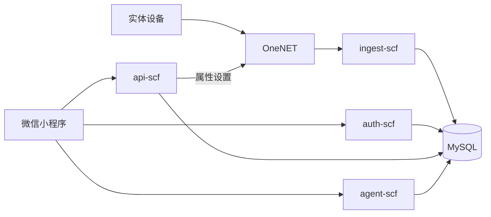

# TRT Nova 当前系统现状与改进路线

> 文档定位：当前实现基线、问题清单与阶段改进计划  
> 基线目录：`TRT_Nova_MVP_miniprogram_LastScf`  
> 基线日期：2026-07-18  
> 最近审阅：2026-07-19  
> 上位文档：[植宠软件系统架构蓝图](./plant-pet-software-system-blueprint.md)

---

## 0. 本文与架构蓝图的分工

《植宠软件系统架构蓝图》回答“长期应建设成什么样”，原则上保持稳定。

本文回答：

1. 当前代码和已验证链路实际做到什么程度；
2. 当前实现与目标架构之间有哪些差距；
3. 哪些问题正在影响安全、可靠性和产品闭环；
4. 下一阶段具体改什么、怎样验收、完成后更新什么状态。

本文会随代码、部署和测试结果持续更新。不得用本文中的临时技术限制反向缩小长期架构愿景，也不得把架构蓝图中的目标能力写成当前已经实现。

### 0.1 状态口径

| 状态 | 定义 |
|---|---|
| 已验证 | 在目标环境通过可重复验收，并有结果或测试证据 |
| 已实现待验证 | 代码存在，但没有完成目标环境或完整链路验证 |
| 局部实现 | 只覆盖部分场景、快乐路径或界面壳 |
| 未建设 | 当前没有可使用实现 |
| 存在风险 | 功能可运行，但有安全、数据或稳定性问题，不能按正式能力承诺 |

“曾经手工跑通过一次”只能作为联调记录，不自动等于稳定的“已验证”。

---

## 1. 当前版本范围与基线说明

### 1.1 当前工作目录

本文只审视：

`TRT_Nova_MVP_miniprogram_LastScf`

该目录在仓库历史中对应“采用简易 SCF 后端”的版本。仓库另有 `TRT_Nova_MVP_miniprogram` 兄弟目录，包含后续 Redis 改造。两个目录尚未被明确收敛成唯一正式主线，因此不能把兄弟目录的能力算入本基线。

### 1.2 当前主要技术组成

- 微信小程序原生页面：主要用户端；
- Flutter：多页面 UI 原型，目前使用 mock 数据；
- `auth-scf`：微信登录、用户落库、JWT 签发；
- `api-scf`：设备、待办、日记、植物库、用户资料与下行控制；
- `ingest-scf`：OneNET/EMQX 数据接入、归一化和历史写入；
- `agent-scf`：只读植物助手、规则、轻量知识检索和可选 LLM；
- `history-cleanup-scf`：历史数据定期清理实现；
- MySQL：当前业务和设备数据主库；
- OneNET：当前已文档化的正式设备接入和控制平台；
- CloudBase 兼容代码：保留在仓库中，但不再是设备正式主链路。

### 1.3 当前实际主链路

控制和状态回显是两条相连但不同的链路：

- 控制：小程序 → `api-scf /device/cmd` → OneNET → 设备；
- 回显：设备重新上报 → `ingest-scf` → `device_latest` → 小程序。

因此 `/device/cmd` 成功只表示平台接受或发送了命令，不能表示设备已经完成执行。

---

## 2. 当前用户可见效果

### 2.1 微信小程序

当前已有页面：

- 首页：设备切换、环境与传感器信息、任务、风扇等主要入口；
- 助手：结构化植物管家对话界面；
- 植物库：植物浏览、搜索、收藏与养护内容；
- 我的：用户资料和相关功能入口；
- 设备绑定、设备详情、设备设置；
- 植物日记、花园、资料编辑、关于页面。

当前效果已经超过纯静态原型，部分页面能消费真实 SCF/MySQL 数据。但体验仍存在以下 Demo 特征：

- 登录方式中包含无服务端验证的本地手机号入口；
- 部分配置和字段映射硬编码；
- 网络失败、陈旧数据和空状态尚未完全统一；
- 页面逻辑较重，首页和设备详情承担了较多数据转换与业务判断；
- 缺少稳定自动化回归，页面“可用”主要依赖人工联调。

### 2.2 Flutter

当前已有登录、首页、助手、植物库、资料、设备详情、设置和日记等 UI 页面，能够表达未来独立 App 的主要信息架构。

当前仍主要依赖 `mock_data.dart`：

- 没有接入真实微信/账号认证；
- 没有接入当前 SCF API；
- 没有正式 Token 和会话持久化；
- 没有形成与小程序共享的契约测试；
- 尚不能被视为正式第二客户端。

短期应将其定位为体验原型，避免与小程序同时维护两套尚未稳定的业务实现。

### 2.3 植物管家 Agent

当前 `/agent/chat` 已具备：

- 设备最新状态读取；
- 部分历史趋势摘要；
- 确定性植物风险规则；
- `plant_library` 和协议知识的轻量检索；
- 可选的 OpenAI-compatible LLM；
- LLM 未配置或失败时的本地回退；
- 结构化建议输出；
- 只读安全边界，不直接控制设备、不直接创建待办。

目前它更接近“带设备事实的智能解释器”，还不是完整长期陪伴 Agent。会话持久化、事实引用、系统化评估、用户反馈、长期记忆和确认式动作均未完成。

---

## 3. 当前模块成熟度

| 系统部分 | 当前状态 | 当前已有 | 当前主要缺口 |
|---|---|---|---|
| 微信小程序 | 局部实现 | 主要页面、SCF 服务层、真实设备展示 | 模块化、统一状态语义、E2E、产品闭环验收 |
| Flutter | 局部实现 | 页面与 mock 交互 | 认证、真实 API、状态管理、发布体系 |
| 身份认证 | 存在风险 | 微信 code、JWT、用户入库 | 禁止外部 openid 回退、移除伪登录、密钥治理 |
| 设备权限 | 局部实现 | `device_acl`、绑定/解绑/资料 | 家庭角色、设备转移、审计、权限测试 |
| OneNET 接入 | 已验证 | webhook 验签/解密、latest/raw/agg 入库 | 幂等证据、异常数据治理、容量验证 |
| EMQX 兼容 | 已实现待验证 | 接入和下行代码路径 | 是否纳入正式架构、真实环境联调 |
| 设备当前状态 | 已验证 | `device_latest` 读模型 | 完整影子、质量和新鲜度字段、状态机 |
| 设备历史 | 局部实现 | raw/agg、趋势查询 | 聚合正确性、降采样、保留任务运行证明 |
| 设备控制 | 存在风险 | ACL、OneNET 下发、风扇映射 | 动作白名单、状态机、审计、回执关联 |
| 养护规则 | 局部实现 | 客户端阈值、Agent 诊断规则 | 服务端统一、品种化、版本化、效果评估 |
| todo | 局部实现 | 列表、新增、完成、紧急状态 | 周期任务、提醒调度、行动结果关联 |
| 植物日记 | 局部实现 | 月/日查询与记录 | 媒体、统一时间线、自动事件、成长里程碑 |
| 植物知识 | 局部实现 | `plant_library`、本地数据、轻量检索 | 权威来源、审核、版本、管理后台 |
| Agent | 局部实现 | 只读工具、规则、知识、可选 LLM | 引用、会话、评估、记忆、确认动作 |
| 天气 | 局部实现 | 客户端服务框架 | 正式配置、授权、服务端代理和缓存 |
| 通知 | 局部实现 | 离线判断、订阅接口框架 | 后端调度、模板、去重、恢复通知 |
| 历史清理 | 已实现待验证 | 清理 SCF 和保留参数 | 定时部署、指标、清理结果验证 |
| 运营后台 | 未建设 | 主要靠控制台和数据库 | 内容、设备、客服、规则与功能开关 |
| 数据分析 | 未建设 | 无统一口径 | 埋点、业务指标、实验和成本分析 |
| 可观测性 | 未系统建设 | 云函数日志 | 指标、追踪、告警、看板、运行手册 |
| 自动化测试 | 未系统建设 | JS 静态语法通过、Flutter 示例测试文件 | 单元、契约、集成、E2E、硬件在环 |

---

## 4. 当前数据模型

### 4.1 已使用的主要实体

- `users`：用户身份与资料；
- `devices`：设备主数据和 IoT 身份；
- `device_acl`：用户与设备关系，以及别名、位置、植物类型等用户侧配置；
- `device_latest`：设备最新状态；
- `device_history_raw`：原始历史数据；
- `device_history_agg`：聚合趋势数据；
- `todos`：养护待办；
- `plant_library`：植物知识主数据；
- `user_plant_favorites`：用户植物收藏；
- 植物日记相关数据。

### 4.2 当前数据模型的优点

- 设备主数据与用户绑定关系已经分离；
- latest 与 history 分离，首页不必扫描历史；
- OneNET 只负责设备接入，不负责用户归属；
- 植物知识逐步转为结构化字段，可同时服务页面和 Agent。

### 4.3 当前最大模型缺口

目前缺少独立 `PlantPet` 实体。植物个体仍主要通过 `device_acl` 上的植物类型、别名和设备关系表达，造成：

- 植物更换设备时长期历史难以自然延续；
- 同一设备更换植物时容易混淆历史；
- 多用户共养和关系成长缺少主体；
- 日记、记忆、人格和生命周期容易被错误绑定到设备；
- “品种知识”和“这一株植物的个体状态”没有彻底分开。

改进时不应直接删除现有字段，而应先新增植宠实体和带时间范围的设备关联，再分阶段迁移消费者。

---

## 5. 当前值得保留的架构判断

以下判断已具备长期价值，不应在改进过程中轻易推翻：

1. 客户端不直接访问 OneNET 和数据库；
2. OneNET/IoT 平台负责设备接入，业务后端负责用户和领域逻辑；
3. `productId + deviceName` 形成设备逻辑标识；
4. `devices` 与 `device_acl` 分离；
5. `device_latest` 作为首页和详情的当前状态读模型；
6. 控制意图与设备真实状态分离；
7. Agent 当前保持只读，动作能力后续通过独立确认接口开放；
8. 植物知识优先结构化，规则、知识和 LLM 分工；
9. 先使用 SCF + MySQL 验证闭环，再根据证据引入更重基础设施。

---

## 6. 当前问题与风险

### 6.1 P0：安全与身份

#### 疑似真实凭证出现在环境示例

多个 `.env.example` 中存在看起来可用的数据库、微信、JWT 和 IoT 凭证。即使文件被 Git 忽略，只要进入共享目录、部署包或聊天传输，也应按泄露处理。

**改进**：立即轮换；示例只保留 `<placeholder>`；凭证进入密钥管理/部署环境；增加提交前密钥扫描。

#### API 与 Agent 存在 openid 回退

在没有合法 JWT 时，服务端仍可能从 header/body/DEBUG 配置取得 openid。正式公网接口不能信任客户端提供的身份。

**改进**：正式环境只接受验证通过的 JWT 或可信网关注入身份；所有调试身份受环境硬隔离；添加越权测试。

#### 手机号登录属于本地 Demo 身份

当前手机号入口不经过短信验证码和服务端认证，只在本地构造 `phone_<number>`。

**改进**：开发模式明确标记并禁止进入生产包；如果需要正式手机号登录，重新设计验证码、风控、账号合并和注销流程。

### 6.2 P0：设备控制

`/device/cmd` 已检查 ACL，但仍接受任意 JSON 物模型参数。它扩大了误操作和未来 Agent 工具滥用风险。

**改进**：

- 第一阶段只开放 `fan_on/fan_off` 等业务动作；
- 后端映射底层物模型字段；
- 加入动作 Schema、幂等键、权限和频率限制；
- 保存命令审计；
- 明确 `dispatched/acknowledged/verified/failed/timed_out`；
- 前端移除普通用户可见的任意 JSON 命令输入。

### 6.3 P0：版本与部署基线分叉

当前目录与包含 Redis 改造的兄弟目录同时存在。团队无法仅凭仓库 HEAD 判断哪套代码应部署、哪套文档代表正式架构。

当前 5 个 SCF 包只有 `ingest-scf` 提交 lockfile，`mysql2` 版本未统一，未声明统一 Node.js `engines`，且 `ingest-scf/node_modules` 被纳入版本控制。这会导致不同成员和环境得到不同依赖与部署产物。

**改进**：选择唯一主线；记录选择理由；迁移有效改动；统一源码工作区、Node 运行时、依赖版本和 lockfile；由 CI 生成部署包；停止把生成依赖当作手工维护源码；建立部署 manifest 和版本标签；旧目录只读归档。

### 6.4 P1：可靠性与状态语义

- latest 查询失败时应保留上次成功数据并标记陈旧，而不是清空；
- 离线目前主要基于最新上报时间和页面刷新，通知并不实时；
- bool/字段兼容虽已修复，但没有设备协议契约测试防止回归；
- 命令回执和随后的属性上报没有完整关联；
- 历史聚合与清理有代码，但缺少持续运行证据；
- 外部服务错误可能把内部错误细节直接返回客户端。

### 6.5 P1：业务规则分散

养护阈值、离线判断、页面表达和 Agent 诊断分散在不同位置。随着植物种类增加，容易出现同一设备在首页正常、Agent 却判断异常的情况。

**改进**：建立服务端统一 Assessment 输出；客户端只消费风险和展示状态；规则带版本、品种范围和事实依据。

### 6.6 P1：缺少可重复质量证明

当前 JavaScript 文件通过语法检查，但语法正确不能证明业务正确。Flutter 测试依赖状态也未形成稳定验证结果。

优先补齐：

- JWT、ACL 和越权单元/集成测试；
- OneNET payload 归一化样例测试；
- 遥测重复、乱序、bool 和异常字段测试；
- 登录—绑定—上报—查询—控制—回报 E2E；
- Agent 事实正确性和安全降级评估；
- 真实硬件断网、重连和控制超时测试。

### 6.7 P2：产品闭环不完整

当前已经能“展示、建议、记录”，但建议、任务、实际行动和效果验证尚未连成统一闭环。植宠人格也缺少独立个体和长期成长数据支撑。

---

## 7. 改进工作流

### 工作流 A：安全收口

**目标**：当前公网能力达到最低正式安全边界。

**任务**：凭证轮换、身份 fail-closed、Demo 登录隔离、设备动作白名单、日志脱敏、错误响应收敛。

**验收**：伪造 openid 无法访问任何资源；非设备 owner 无法控制；仓库扫描无有效凭证；控制审计可追溯。

### 工作流 B：单一发布基线

**目标**：任何成员都能回答“当前正式代码、配置、数据库 Schema 和部署版本在哪里”。

**任务**：主线选择、Redis 改造评审、目录合并、环境矩阵、部署清单、版本标签和回滚说明。

**验收**：staging 可从干净环境重复部署；部署产物能对应唯一 commit；旧实现明确归档。

### 工作流 C：关键链路可靠化

**目标**：登录、上报、读取和控制链路具备可重复证明和故障降级。

**任务**：契约测试、E2E、幂等、数据新鲜度、状态保留、命令状态机、监控告警。

**验收**：关键链路自动化通过；弱网和依赖故障不产生错误事实；可通过 traceId 定位跨服务请求。

### 工作流 D：植宠领域独立

**目标**：从“设备上挂植物信息”演进为“植宠可关联设备”。

**任务**：`plant_pets`、`pet_device_bindings`、迁移脚本、兼容 API、日记/todo/Agent 上下文迁移。

**验收**：同一植宠更换设备后保留日记和成长；同一设备更换植物后历史边界清晰；旧客户端在迁移期仍能使用。

### 工作流 E：养护闭环

**目标**：建议能够转为任务或动作，并能验证结果。

**任务**：统一 Assessment、Recommendation、CareTask、CareAction 和 TimelineEvent；后端提醒；效果复查。

**验收**：一次“土壤偏干”能完整追踪到建议、任务、用户浇水、湿度恢复和日记事件。

### 工作流 F：Agent 质量化

**目标**：从功能 Demo 变成可测量、可信的植物管家。

**任务**：事实来源和时间展示、会话、评估集、知识版本、用户反馈、工具调用审计、确认式动作候选。

**验收**：设备事实问题有来源；无数据时明确表达未知；模型失败可安全回退；动作必须经独立后端校验和用户确认。

### 工作流 G：运营与可观测性

**目标**：故障和内容维护不再全部依赖开发者直接查库。

**任务**：指标、告警、运行手册、基础设备诊断、植物内容发布、功能开关和客服查询。

**验收**：关键故障主动告警；支持人员在最小权限下完成常见排查；内容更新无需改代码和直接写生产库。

---

## 8. 实施路线入口

本文只维护当前事实、成熟度和问题；具体研发顺序、阶段退出条件、SCF 内模块迁移方式和基础设施进入门槛统一维护在[植宠系统实施顺序与演进路线](./plant-pet-implementation-roadmap.md)，避免两份文档出现不同施工顺序。

当前必须从该路线的 R0 开始：冻结唯一 Demo 基线，然后依次完成安全发布、工程迁移、设备可靠化、PlantPet 独立、养护闭环和 Agent 产品化。未达到对应退出条件不得跳步骤建设重型基础设施。

---

## 9. 状态更新责任

软件负责人应在以下时机更新本文：

- 正式主线或部署架构变化；
- 模块由“实现”转为“验证”；
- 新增或关闭 P0/P1 风险；
- 数据 Schema 或关键链路变化；
- 阶段退出条件完成；
- 真实试用得出新的产品或容量结论。

每次更新至少记录：日期、变更模块、证据、负责人、尚未解决问题和下一次复核时间。
